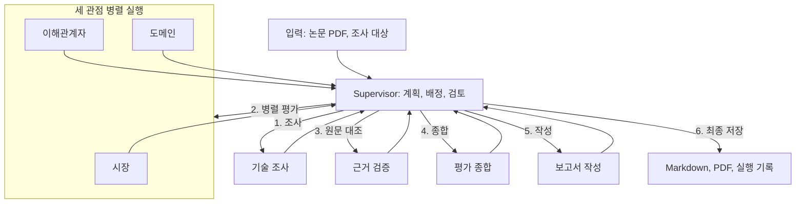

# 1. 자동 테스트

# SKALA: 근거 기반 기술 다관점 평가

TurboQuant와 CXL-Hybrid 메모리 기반 ITME의 **기술, 시장, 이해관계자, 도메인** 관점 조사, 근거 검증, Markdown/PDF 보고서 생성

## 실행 준비

**Python 3.14** 기준

```bash
uv sync --locked --extra dev --extra rag
source .venv/bin/activate
python main.py --demo                 # API 없이 전체 흐름 확인
```

pip 사용 시 Python 3.14 가상환경에서 `pip install -r requirements.txt`로 설치
데모의 `needs_review`: 예시 데이터에 대한 검토 필요 표시, 오류 아님

실제 실행 전 `.env` 설정 입력, `data/raw/`에 논문 PDF 배치 필요

```dotenv
LLM_MODEL=gpt-5.6-luna
LLM_API_KEY=발급받은_OpenAI_키
TAVILY_API_KEY=발급받은_Tavily_키
MAX_TOTAL_CALLS=400
```

기본 호출 예산: 총 400회, 후속 검증/종합/보고서용 100회 보존
조사 요청 절감: 원문 공유 캐시, 출처 연결 우선 보정, 새 원문 없는 재검색 중단

## 전체 실행 순서

```bash
source .venv/bin/activate

# 1. 자동 테스트, 외부 API 호출 없음
python -m pytest -q

# 2. 실제 LLM 응답, 구조화 출력, Tavily 검색 확인
python scripts/api_smoke.py

# 3. 논문 검색 인덱스 생성
python -m scripts.build_index

# 4. 전체 조사, 근거 검증, 보고서 생성
python main.py
```

각 단계 성공 확인 후 다음 명령 실행 권장, 2번과 4번의 실제 API 호출 비용 발생
기존 인덱스가 있고 논문 변경이 없다면 3번 생략 가능, PDF 변경 시 `--force`로 재생성

첫 인덱스 생성 시 BGE-M3 모델 다운로드
macOS 기본 폰트: AppleGothic, 다른 한글 TTF 사용 시 `.env`의 `PDF_FONT_PATH`에 경로 지정

## 실행 화면 및 결과

`main.py` 기본 화면: 단계별 상태 박스, 실행 중 표시, 병렬 평가 및 근거 검증 진행 막대
호출 사용량/한도, 종류별 사용 횟수, 작업 시간 한도 및 남은 시간 표시, 호출 80% 이상 노란색, 소진 시 빨간색 표시
LLM, 검색, 원문 읽기의 실행 중 시간과 종료 호출의 최근/평균/누적/최대 시간 표시, 개별 호출 시간은 `events.jsonl`에 기록
`--plain`: 줄 단위 로그, `--quiet`: 진행 화면 생략, 파일 출력 시 일반 로그 자동 전환

결과 위치: `outputs/{run_id}/`

| 파일                                      | 내용                           |
| ----------------------------------------- | ------------------------------ |
| `report.pdf`, `report.md`             | 검토 통과 보고서               |
| `draft-report.pdf`, `draft-report.md` | 추가 검토 필요 초안, 데모 결과 |
| `events.jsonl`                          | 상세 실행 로그                 |
| `result.json`                           | 최종 상태와 결과               |
| `tasks/`                                | 작업별 호출 회차 결과          |

결과 상태: `completed`(검토 통과), `needs_review`(추가 검토 필요), `failed`(실패)
API 연결 점검 기록: `검증문서/테스트/실행결과/`

## 작동 구조

Supervisor의 단계별 결과 검토 및 다음 작업 배정, 모든 에이전트의 결과를 Supervisor로 반환



근거 부족이나 검토 실패 시 한도 내 해당 단계 재실행
조사 도구: **논문 RAG(BGE-M3 + FAISS), 웹 검색(Tavily), 원문 읽기**

## 디렉토리 구조

```text
├── main.py              # 실행 진입점
├── src/
│   ├── graph.py         # 에이전트 연결, 병렬 실행
│   ├── agents/          # 8개 역할의 에이전트
│   ├── tools/           # 검색, RAG, 원문 읽기
│   ├── common/          # 로그, 호출 한도, 저장
│   ├── exporters/       # PDF 생성
│   └── legacy/          # 초기 코드 보관
├── prompts/             # 역할별 프롬프트
├── data/raw/            # 논문 PDF
├── data/index/          # 생성한 검색 인덱스
├── outputs/{run_id}/    # 보고서, result.json, events.jsonl, 작업별 결과
├── scripts/             # 인덱스 생성, API 점검
├── tests/               # 자동 테스트 코드
└── 검증문서/
    ├── 기술문서/         # 설계, 인터페이스, 구현 설명
    ├── 디버깅/           # 오류 원인과 수정 이력
    └── 테스트/           # 단계별 검증표, 실행결과/
```

Git 제외 대상: `.env`, 원문 PDF, 인덱스, 실행 산출물

## 담당

| 담당 | 역할                  |
| ---- | --------------------- |
| 시은 | Supervisor, 기술 조사 |
| 민형 | 시장, 이해관계자      |
| 연수 | 도메인, 근거 검증     |
| 재혁 | 평가 종합, 보고서     |

[문서 안내](검증문서/README.md) | [단계별 검증](검증문서/테스트/단계별검증.md) | [오류 이력](검증문서/디버깅/ISSUES.md) | [구현 명세](https://app.notion.com/p/3e209004d9f8806ebbfbd59733bb5293)
