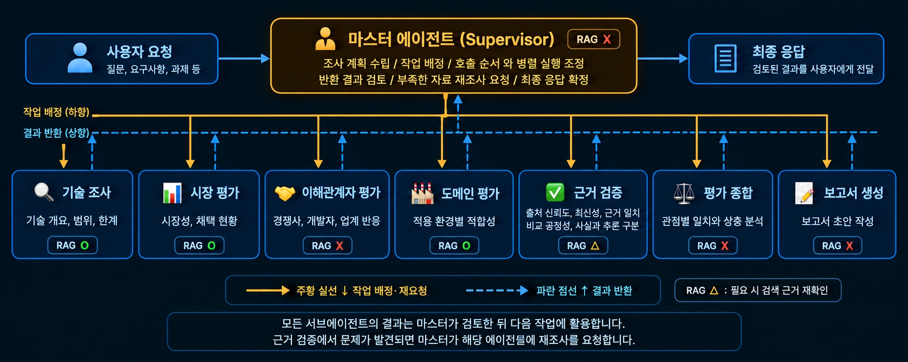

> Subject → Overview → Selected Technologies → Features → Tech Stack → Agents → Architecture → Directory Structure → Usage → Contributors

# Subject

## Overview

SW 기반 KV cache 압축 기술인 TurboQuant와 CXL 기반 메모리 확장 시스템인 ITME를 비교·평가하는 프로젝트다.

- 적용 도메인: `클라우드 기반 LLM 서빙`
  선정 이유: 클라우드 LLM 서빙은 SW 압축과 HW 메모리 확장 접근이 모두 적용될 수 있는 환경으로, 두 기술을 비용, 성능, 품질, 운영 조건이라는 동일한 비교하기에 적합하다.
  논문과 공개 자료의 근거 및 적용 조건을 바탕으로 두 기술의 장점, 제약, 관점 별 평가 차이를 분석한다.

### 평가 관점

1. 기술 성숙도: 기술 원리, 성능 검증 수준, 적용 범위와 한계
2. 시장성: 시장 규모, 상용화 현황, 채택 사례와 성장 전망
3. 이해관계자: 경쟁사, 도입 기업, 개발자, 투자 업계의 기대와 우려
4. 도메인 적용: 클라우드 LLM 서빙에서의 성능, 비용, 운영 조건

### 주요 구성

| 구분      | 내용                                                                                                    |
| --------- | ------------------------------------------------------------------------------------------------------- |
| 목표      | • KV cache 압축 vs. 메모리 확장  • 기술, 시장, 이해관계자, 클라우드 적용성 비교                       |
| 방법      | • LangGraph 기반 Multi-Agent  • Supervisor 중심 작업 조정  • 논문 검색 기반 Agentic RAG              |
| 코드 구조 | •`src/kv_cache_agent/` 내 역할별 분리  • 에이전트, 그래프, 데이터 규격  • RAG, 도구, YAML 프롬프트 |
| 검색 구성 | • PDF 분할 → BGE-M3 → FAISS  • 논문 및 웹 검색, 원문 수집  • 인용 확인                             |
| 검증 구성 | • 에이전트, State, 전체 그래프 테스트  • RAG 및 웹 도구 테스트  • 샘플 입력 데이터 활용              |

# Selected Technologies

| 구분 | 선정 기술                                          | 핵심 접근                                                                                            | 선정 이유                                                  |
| ---- | -------------------------------------------------- | ---------------------------------------------------------------------------------------------------- | ---------------------------------------------------------- |
| SW   | TurboQuant                                         | • KV cache 저비트 압축  • 메모리 사용량 절감  • 압축에 따른 답변 품질 영향 확인                   | 메모리 절감과 답변 품질의 균형을 평가하기 위해 선정        |
| HW   | CXL-based 메모리 확장- 대표 논문 및 구현 사례:ITME | • CXL 메모리와 SSD 활용 용량 확장  • 정보 분산 저장, 필요 시 전송  • 데이터 이동에 따른 지연 고려 | 메모리 확장의 이점과 전송 지연의 한계를 비교하기 위해 선정 |

**공통 적용 도메인: 클라우드에서 LLM 서비스를 운영하는 환경**

- 플랫폼 역할: 외부 소프트웨어와 하드웨어를 도입하고 연결해 LLM 서비스 제공
- 기술 활용: TurboQuant로 메모리 사용량 절감, CXL로 사용 가능한 메모리 용량 확장
- 비교 관점: 도입 및 운영 비용, 처리 성능, 기술과 장비의 확보 가능성, 관련 기업과 사용자의 기대 및 우려

# Features

## 주요 기능

- **PDF 기반 정보 추출**: TurboQuant 및 ITME 논문의 기술 원리, 실험 조건, 성능과 한계 추출
- **논문 검색**: BGE-M3 임베딩과 FAISS 기반 관련 청크 검색
- **웹 자료 조사**: Tavily 기반 시장 현황, 이해관계자 반응, 클라우드 적용 자료 조사
- **다관점 병렬 평가**: 공통 기술 조사 결과를 활용한 시장, 이해관계자, 클라우드 도메인 평가 병렬 실행
- **근거 추적**: 근거 카드 기반 주장, 출처, PDF 페이지 및 청크 ID 관리
- **근거 검증**: 원문과 주장 대조, 출처 정보 확인, 사실과 추론 구분
- **평가 종합**: 검증된 근거 기반 관점별 일치점, 상충점, 조건부 권고 및 불확실성 정리
- **보고서 구성**: YAML 목차 기반 Markdown 보고서 구성 및 본문 인용과 참고문헌 연결

## 확증 편향 방지 전략

- **비교 균형 확인**: 두 기술의 유효 근거 존재 여부와 공통 평가 관점 확인 (검증 로직 반영)
- **동일 조건 중심 해석**: 모델, 장비, 부하가 다른 실험 수치의 직접 우열 비교 제한 (종합 프롬프트 반영)
- **검증 근거 중심 판단**: 검증된 근거 카드 활용 및 판단별 근거 ID 연결 (프롬프트 및 검증 로직 반영)
- **사실과 추론 구분**: 사실, 추론, 자료 한계의 분리와 불확실성 명시 (출력 규격 및 프롬프트 반영)
- **근거 부족의 과도한 해석 방지**: 자료 부족을 시장 부재나 기술 열세로 단정하는 해석 제한 (종합 프롬프트 반영)
- **반대 근거 탐색 강화**: 반대 근거의 체계적 검색 및 수집 여부 평가 (추가 보완 필요)

# Tech Stack

선정 기준: 필요한 기능과 결과 품질을 충족하면서 반복 호출 비용과 로컬 실행 부담을 줄이는 구성

| 구분                   | 기술                               | 용도 및 선정 이유                                                                                                       |
| ---------------------- | ---------------------------------- | ----------------------------------------------------------------------------------------------------------------------- |
| Framework              | **LangGraph**                | • 검증 결과와 근거 충족 여부에 따른 조건 분기  • 정상 처리, 근거 부족, 오류 경로 구분  • State 공유와 병렬 실행 관리 |
| Framework              | **LangChain**                | • 문서 처리, 검색, 프롬프트 구성  • 모델 호출과 응답 처리의 순차적 연결  • 공통 인터페이스 기반 구성요소 재사용      |
| LLM Provider           | **OpenAI**                   | • 로컬 생성 모델 구동 없이 API 활용  • 목적에 필요한 품질과 경제성 고려  • 토큰 사용량 기반 비용 관리                |
| LLM / Generator, Judge | **GPT-4o-mini**              | • 조사, 검증, 종합 과정의 반복 호출  • 비용과 성능의 균형 고려                                                        |
| Retrieval              | **FAISS**                    | • MIT 라이선스 오픈소스 기반 로컬 검색  • 별도 관리형 Vector DB 구독 불필요  • 소규모 논문 자료의 반복 검색          |
| Embedding              | **BGE-M3 (`BAAI/bge-m3`)** | • 한국어와 영어 문서 및 질문의 벡터 변환  • 호출별 임베딩 API 요금 고려  • 로컬 MacBook 실행 부담 고려               |

### LLM 경제성 판단 기준

품질 조건을 통과한 모델 중 유효한 보고서 1건당 비용이 낮은 모델을 선정

| 평가 항목   | 판단 기준                                                                                |
| ----------- | ---------------------------------------------------------------------------------------- |
| 목적 충족   | • 동일한 사용자 질문과 근거 자료 기반 한국어 보고서 작성  • 필수 평가 관점과 목차 충족 |
| 결과 신뢰성 | • 출력 스키마 준수  • 본문 인용과 근거 일치  • 근거 없는 주장과 필수 항목 누락 확인   |
| 비용        | • 총 API 비용 ÷ 품질 조건을 통과한 보고서 수  • 실패와 재시도 비용 포함               |
| 처리 시간   | • 보고서 완료 시간 비교  • 호출별 지연시간, 재시도 횟수 비교                           |

- GPT-4o mini 선정

### BGE-M3 규모와 로컬 선정 근거

| 항목           | 수치 및 의미                                                                                              |
| -------------- | --------------------------------------------------------------------------------------------------------- |
| 파라미터 수    | • 약 0.57B  • 공식 BGE Series 표 기준 568M                                                              |
| 모델 크기      | • 공식 안내 기준 2.27 GB  • 전체 추론 메모리 사용량과 구분                                              |
| 출력 벡터      | • 문서와 질문당 1,024차원                                                                                |
| 최대 입력 길이 | • 최대 8,192토큰  • 입력 길이와 배치 크기에 따른 메모리, 처리 시간 변동                                 |
| 언어 지원      | • 100개 이상 언어 지원  • 한국어 질문과 영어 논문 검색에 활용                                           |
| 비용 구조      | • MIT 라이선스 모델의 로컬 실행  • 호출별 API 요금 제거  • 로컬 메모리, 저장 공간, 전력 사용 별도 부담 |

선정 이유: 다국어 검색 능력과 모델 규모를 절충한 로컬 실행용 선택
현재 프로젝트의 검색 구성은 다음과 같음

- 청크 크기: 3,500자
- 청크 중첩: 500자
- 검색 방식: FAISS dense 벡터 검색

## RAG 자료 구성

논문의 경우, 노션에 게시된 레퍼런스 논문을 분야별로 1건씩 선정했다.

- SW : TurboQuant
- HW : ITME

| 구분      | TurboQuant                                                                                      | ITME                                                                                                              |
| --------- | ----------------------------------------------------------------------------------------------- | ----------------------------------------------------------------------------------------------------------------- |
| 논문명    | **TurboQuant: Online Vector Quantization with Near-optimal Distortion Rate**              | **ITME: Inference Tiered Memory Expansion with Disaggregated CXL-Hybrid Memories**                          |
| 로컬 파일 | `data/papers/turboquant.pdf`                                                                  | `data/papers/cxl_based_kv_cache.pdf`                                                                            |
| 파일 버전 | arXiv:2504.19874v1                                                                              | arXiv:2606.12556v2                                                                                                |
| 버전 날짜 | 2025-04-28                                                                                      | 2026-06-16                                                                                                        |
| 페이지 수 | **25쪽**                                                                                  | **13쪽**                                                                                                    |
| 주요 내용 | • 온라인 벡터 양자화  • 압축 오차와 내적 왜곡 감소  • KV cache 저비트 압축 및 품질 유지 실험 | • CXL-Hybrid 기반 추론 상태 용량 확장  • 다계층 DMA 프리패치  • CMM 및 NVMe SSD 성능 평가  • FPGA 시제품 검증 |
| RAG 활용  | • SW 압축 원리  • 실험 조건  • 메모리 절감과 품질의 관계                                     | • HW 확장 구조  • 데이터 이동  • 처리량  • 검증 범위                                                          |

### 인덱스 구성

| 항목           | 구성                             |
| -------------- | -------------------------------- |
| TurboQuant     | 27개 청크                        |
| ITME           | 27개 청크                        |
| 전체           | 54개 청크                        |
| 벡터 차원      | 1,024차원                        |
| 근거 추적 정보 | 파일명, PDF 페이지 번호, 청크 ID |

### 자료 활용 범위

- 논문 RAG: 기술 원리와 실험 조건에 대한 근거 검색
- 웹 조사: 최신 시장 현황과 채택 사례 보완
- 근거 추적: 주장과 원문 위치를 대조할 수 있도록 출처 정보 보관

# Agents

| 에이전트        | 대응 파일            | 주요 역할                                                                                    | RAG |
| --------------- | -------------------- | -------------------------------------------------------------------------------------------- | --- |
| 슈퍼바이저      | `supervisor.py`    | • 조사 계획, 작업 배정  • 실행 순서와 병렬 처리 조정  • 결과 검토, 재조사 요청            | X   |
| 기술 조사       | `technical.py`     | • 두 기술의 원문 확보  • 기술 개요, 적용 범위 정리  • 성능 조건과 한계 추출               | O   |
| 시장 평가       | `market.py`        | • Tavily 및 수집 자료 활용  • 시장 규모, 상용화 현황 조사  • 채택 사례, 성장 전망 분석    | O   |
| 이해관계자 평가 | `stakeholder.py`   | • 경쟁사, 도입 기업 반응 조사  • 개발자, 투자 업계 의견 조사  • 기대 효과와 우려 정리     | O   |
| 도메인 평가     | `cloud_domain.py`  | • Tavily 및 수집 문서 활용  • 클라우드 적용성 평가  • 성능, 비용, 운영 조건 분석          | O   |
| 근거 검증       | `verifier.py`      | • 출처 신뢰도, 최신성 확인  • 주장과 근거 일치 검증  • 비교 공정성 확인, 사실과 추론 구분 | △  |
| 평가 종합       | `synthesis.py`     | • 관점별 의견의 일치와 상충 분석  • 적용 조건 차이 정리  • 불확실성 종합                  | X   |
| 보고서 생성     | `report_writer.py` | • 단계별 결과, 종합 의견 정리  • 목차에 맞춘 보고서 구성  • 근거 및 인용 연결             | X   |

- **O**: 외부 문서 또는 웹 검색을 통한 근거 검색 사용
- **△**: 필요 시 근거 문서 재검색
- **X**: 별도 벡터 검색 없이 전달받은 결과 활용

# Architecture



```text
Supervisor (graph/workflow.py)
    ↓
기술 조사
    ↓
시장 평가 / 이해관계자 평가 / 클라우드 도메인 평가
                   병렬 실행
    ↓
세 평가 완료 대기
    ↓
근거 검증
    ↓
평가 종합
    ↓
보고서 생성
```

### 목표 아키텍처

Supervisor가 작업 배정, 실행 순서와 병렬 처리 조정, 결과 검토, 재조사 요청을 담당하는 구조다.

- 주황 실선: 작업 배정과 재요청
- 파란 점선: 결과 반환

> 설계와 구현 구분: 아키텍처는 목표 설계, 현재 구현은 위 실행 흐름 기준.RAG 표기 기준: 이해관계자 평가의 RAG는 회의록 표 기준 `O` 적용(원본 이미지 `X`).

# Directory Structure

```text
SKALA_langgraph/
├── data/
│   ├── papers/                       # 원문 논문 PDF
│   ├── vector_db/                    # FAISS 인덱스
│   └── cache/                        # 수집 및 처리 캐시
├── src/kv_cache_agent/
│   ├── main.py                       # 전체 워크플로 초기화 진입점
│   ├── config.py                     # 공통 환경 및 경로 설정
│   ├── llm.py                        # 공통 LLM 연결
│   ├── agents/
│   │   ├── supervisor.py             # 작업 조정
│   │   ├── technical.py              # 기술 조사
│   │   ├── market.py                 # 시장 평가
│   │   ├── stakeholder.py            # 이해관계자 평가
│   │   ├── cloud_domain.py           # 클라우드 도메인 평가
│   │   ├── verifier.py               # 근거 검증
│   │   ├── synthesis.py              # 평가 종합
│   │   └── report_writer.py          # 보고서 생성
│   ├── graph/                        # State, 실행 그래프, 라우팅
│   ├── schemas/                      # 결과, 근거 카드, 도구 응답 규격
│   ├── rag/                          # PDF 분할, 임베딩, 인덱스 구성
│   ├── tools/                        # 논문 검색, 웹 검색, 원문 수집, 인용 확인
│   └── prompts/                      # 에이전트별 YAML 프롬프트
├── tests/
│   ├── fixtures/                     # 샘플 기술 조사 결과
│   ├── test_state.py                 # 공통 State 및 규격 테스트
│   ├── test_workflow.py              # 전체 실행 그래프 테스트
│   ├── test_paper_rag.py              # 논문 RAG 테스트
│   ├── test_web_tools.py             # 웹 도구 테스트
│   ├── test_market.py                # 시장 평가 테스트
│   ├── test_synthesis.py             # 평가 종합 테스트
│   └── test_report_writer.py         # 보고서 생성 테스트
├── outputs/
│   ├── reports/                      # 보고서 산출물
│   └── runs/                         # 실행별 산출물
├── .env.example                      # 환경변수 예시
├── .gitignore                        # Git 추적 제외 규칙
├── .python-version                   # Python 버전 지정
├── pyproject.toml                    # 프로젝트 및 의존성 설정
├── uv.lock                           # 의존성 잠금 파일
├── DEVELOPMENT_ORDER.md              # 개발 순서와 담당 범위
└── README.md                         # 프로젝트 안내
```

# Usage

**진행 순서: 환경 준비 → API 키 설정 → 논문 인덱스 생성 → 워크플로 초기화 → 테스트**

## 1. 실행 환경 준비

- 실행 환경: Python 3.11, uv
- 실행 위치: 프로젝트 루트 `SKALA_langgraph/`
- 패키지 설치:

```bash
uv sync
```

## 2. API 키와 모델 설정

`.env` 파일이 없는 경우에만 예시 파일 복사:

```bash
cp .env.example .env
```

`.env`에 아래 항목 설정:

```dotenv
TAVILY_API_KEY=
OPENAI_API_KEY=
OPENAI_MODEL=gpt-4o-mini
EMBEDDING_MODEL=BAAI/bge-m3
HF_TOKEN=
```

- `TAVILY_API_KEY`: 웹 검색용 API 키
- `OPENAI_API_KEY`: LLM 호출용 API 키
- `OPENAI_MODEL`: 사용할 LLM 모델
- `EMBEDDING_MODEL`: 논문 검색용 임베딩 모델
- `HF_TOKEN`: Hugging Face 모델 다운로드용 토큰, 공개 모델 사용 시 선택 사항
- 키 관리: Python 코드나 YAML에 직접 작성하지 않고 `.env`에서 관리

## 3. 논문 검색 인덱스 생성

- 입력 위치: `data/papers/`
- 현재 자료: TurboQuant 및 ITME 논문, 총 38쪽
- 자료 범위: 전체 문서 풀 최대 200페이지 이내

```bash
uv run python -m kv_cache_agent.rag.ingest_papers
```

**처리 과정:** PDF 로딩 → 문서 분할 → BGE-M3 임베딩 → FAISS 인덱스 생성

- 저장 위치: `data/vector_db/`

## 4. 워크플로 초기화

```bash
uv run python -m kv_cache_agent.main
```

> **현재 명령의 수행 범위:** 그래프 생성 및 초기화 메시지 출력까지 수행. 전체 조사 실행과 보고서 파일 저장은 별도 호출 구현 필요.
> **그래프에 구성된 처리 흐름**

```text
Supervisor → 기술 조사
→ 시장, 이해관계자, 클라우드 도메인 평가 병렬 실행
→ 근거 검증 → 평가 종합 → 보고서 생성
```

**전체 그래프 실행 시 결과 및 저장 경로**

- 반환 결과: `GlobalState`의 `final_report` 필드
- 보고서 저장용 경로: `outputs/reports/`
- 실행별 결과와 로그 저장용 경로: `outputs/runs/`
- 파일 저장: 현재 초기화 명령의 자동 저장 기능과 구분

## 5. 테스트

```bash
uv run pytest -q
```

- 일반 테스트: OpenAI와 Tavily API를 Mock으로 대체하는 방식
- 검증 구분: Mock 기반 테스트와 실제 API 연동 검증의 분리

## 6. 재현 조건 관리

**환경 및 모델**

- Python 버전: `.python-version` 기준
- 패키지 버전: `uv.lock` 기준
- LLM 모델: `OPENAI_MODEL` 설정값
- 임베딩 모델: `BAAI/bge-m3`
  **자료 및 검색**
- 원문 자료: `data/papers/`의 동일한 PDF, 전체 200페이지 이내
- 청크 설정: 크기 3,500자, 중첩 500자
- 검색 방식: FAISS 벡터 검색
- 웹 조사 기록: 실행 날짜, 검색 질의, 출처 URL, 발행일
  **검증 및 출력**
- 테스트 환경: OpenAI와 Tavily API Mock 사용
- 결과 형식: `AgentResult`, `EvidenceCard`, `final_report`

> 웹 검색 결과와 시장 정보의 시점별 변동 가능성. 동일 조건 비교를 위한 실행 날짜와 사용 출처 기록 필요.

# Contributors

| 이름   | 담당 에이전트                   | 수행 역할                                                          |
| ------ | ------------------------------- | ------------------------------------------------------------------ |
| 이재혁 | 슈퍼바이저, 기술 조사           | 전체 실행 그래프와 작업 조정, 논문 RAG 기반 기술 조사 구현         |
| 윤시은 | 시장 평가, 이해관계자 평가      | 시장 및 채택 현황 조사, 관계자별 반응과 도입 조건 분석 구현        |
| 주연수 | 클라우드 도메인 평가, 근거 검증 | 클라우드 적용성 평가, 출처 및 주장 검증 구현                       |
| 이민형 | 평가 종합, 보고서 생성          | 관점별 결과의 일치와 상충 분석, YAML 기반 종합 및 보고서 생성 구현 |
