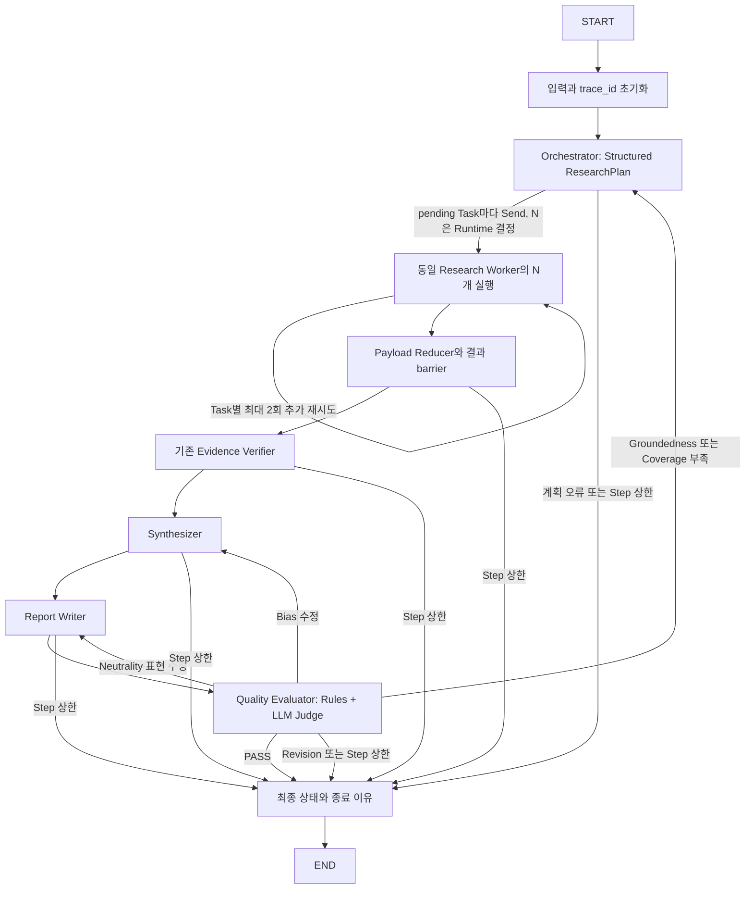

# KV Cache 기술 평가

## Overview

**Objective:** TurboQuant와 CXL-based KV Cache를 기술 성숙도, 시장성, 이해관계자, 도메인 적용성 관점에서 조사하고, 주장과 출처가 연결된 중립적인 평가 보고서를 생성한다. 기본 도메인은 클라우드 LLM 서빙이다. 특정 기술의 추천이나 승자 선정을 목표로 하지 않는다.

**Pattern: Orchestrator-Workers.** Orchestrator가 사용자 질문과 현재 근거, 실패한 Task, 품질 평가를 읽고 LLM Structured Output으로 `ResearchPlan`을 만든다. 그 안의 `SubTask`마다 같은 `research_worker` 노드에 `Send`를 보내므로 Worker 수는 실행 시점에 결정된다.

기존 Fixed Flow는 `Supervisor → Technical → Market / Stakeholder / Cloud Domain → Verifier → Synthesis → Report Writer`였다. 조사 대상 노드와 기술 조사 선행 조건이 고정되고, 작성된 보고서의 품질에 따른 추가 조사 경로가 없었다. 새 흐름에서는 기술 조사도 독립 Task이며, 시장 조사나 도메인 조사가 다른 Worker의 완료를 기다리지 않는다. 필수 네 관점은 보장하되 SW/HW 구현, 상용화, 공급망 등 독립 목표에 따라 같은 관점을 여러 Task로 나눌 수 있다.

이 패턴은 질문마다 필요한 조사 범위가 다르고, 보고서에서 발견된 근거 부족을 선택적으로 보완해야 하는 목적에 적합하다. `supervisor.py`는 이전 단위 테스트와 비교를 위한 호환 코드로 보존하며 현재 실행 그래프에서는 사용하지 않는다.

## Selected Technologies

| 기술 | 평가 대상 | 유지한 논문 입력 |
| --- | --- | --- |
| TurboQuant | SW 기반 KV Cache 표현 압축, 품질과 계산 비용의 조건 | `data/papers/turboquant.pdf` |
| CXL-based KV Cache | ITME를 포함한 CXL 기반 메모리 계층 확장, 이동 비용과 운영 조건 | `data/papers/cxl_based_kv_cache.pdf` |

논문 RAG는 기술 원리와 실험 조건을 확인하고, 웹 조사는 시장과 도입 현황, 이해관계자, 적용 사례를 보완한다. 논문마다 모델, 장비, 부하가 다른 수치는 직접 우열 비교에 사용하지 않는다. PDF와 생성 인덱스는 실행 환경에서 준비해야 한다.

## Features

- **PDF RAG:** 기존 BGE-M3, FAISS, `paper_retriever` 유지. 청크 크기 3,500자, 중첩 500자, PDF 페이지와 청크 ID 보존.
- **Dynamic Planning:** Pydantic `ResearchPlan`과 `SubTask`를 사용한 LLM 계획. 초기 네 관점 누락은 보완 Task로 채우고, 후속 계획은 품질 평가와 기존 근거에 반응한다.
- **Dynamic Fan-out:** 계획에 들어 있는 pending Task마다 `langgraph.types.Send` 생성. 그래프에 관점별 Worker를 미리 등록하지 않는다.
- **Reducer:** 병렬 Payload patch를 Task ID와 Evidence ID로 병합. 같은 결과를 재전달해도 중복을 누적하지 않는다.
- **Worker Fall-back:** 동일 Task를 처음 실행한 뒤 최대 2회 추가 시도. 끝까지 실패하면 근거와 findings를 제외하고 한계를 기록한다. 다른 Task는 계속 처리한다.
- **Bias Control:** 기술별 근거와 출처 분포, 상충 근거, 사실과 추론, 실험 조건 차이 점검. 단일 출처 또는 한 기술의 근거 부재는 추가 조사 대상이다.
- **Quality Evaluation:** 보고서 뒤 독립 노드에서 필수 절, 참고문헌, 인용 연결 규칙과 LLM Judge를 함께 실행한다. Groundedness, Neutrality, Bias Control, Perspective Coverage를 모두 평가한다.
- **Evaluation Loop:** 근거 또는 관점 부족은 계획과 Worker로, 편향은 Synthesizer로, 중립성 표현 문제는 Report Writer로 돌아간다.
- **관측 및 복구:** 최소 JSON 이벤트, `trace_id` 상관 관계, 선택적 LangSmith Trace, 체크포인트 재개 지원.

## Tech Stack

| 구분 | 기술 | 용도 |
| --- | --- | --- |
| Runtime | Python 3.11, uv, `uv.lock` | 실행 환경과 의존성 재현 |
| Orchestration | LangGraph | StateGraph, Send, Reducer, 조건 분기, 체크포인트 |
| LLM integration | LangChain, langchain-openai | Structured Output과 기존 검증, 종합, 보고서 생성 |
| LLM | OpenAI, `OPENAI_MODEL` (기본 `gpt-6-luna`) | Planner, 근거 추출, 검증, 종합, 작성, Judge |
| Retrieval | BGE-M3 (`BAAI/bge-m3`), FAISS | 기존 논문 검색. 병렬 첫 호출에서 모델과 인덱스를 공유 로드 |
| Web | Tavily, httpx, BeautifulSoup | 검색, 원문 수집과 검증 |
| Schemas | Pydantic, TypedDict | 실행 계약과 State 구분 |
| Output | Markdown, ReportLab | 기존 목차와 인용을 유지하는 보고서와 한국어 PDF |
| Observability | logging, LangSmith | 외부 이벤트와 Trace |
| Recovery (선택) | LangGraph SQLite checkpointer | 프로세스 재시작 후 로컬 실행 복구 |
| Validation | pytest, Ruff | 기존 기능 회귀 검사와 새 실행 경로 검증 |

## Agents

| 실행 노드 | 파일 | 책임 |
| --- | --- | --- |
| Orchestrator | `agents/orchestrator.py` | 입력, 현재 근거, 평가 결과를 바탕으로 Task 계획 |
| Research Worker | `agents/research_worker.py` | Task별 paper/web/hybrid 조사, 구조화 결과, 재시도 |
| Reducer barrier | `graph/state.py`, `graph/workflow.py` | 동시 결과 병합 뒤 Task 상태와 실패 목록을 한 번 갱신 |
| Verifier | `agents/verifier.py` | 기존 원문 대조, 사실과 추론 구분, 검증 카드 선별 |
| Synthesizer | `agents/synthesis.py` | 기술별, 관점별 근거 통합, 조건과 불확실성 구분, 판단 → 근거 → 조건 순서의 읽기 쉬운 문장 |
| Report Writer | `agents/report_writer.py` | 지정 목차와 인용 연결, 반복 설명 축약, 실제 PDF 페이지 검사와 제한된 분량 수정 |
| Quality Evaluator | `agents/quality_evaluator.py` | 규칙과 LLM Judge 결합, 품질 문제와 권장 수정 경로 생성 |

기존 조사 파일을 삭제하지 않았다. Worker는 `technical`의 구조화 추출과 청크-근거 연결, `market`의 검색 결과 정규화와 카드 생성, `stakeholder`의 관계자 분류와 기대/우려 카드 생성, `cloud_domain`의 혼합 근거 추출과 URL 검사를 재사용한다. 기존 조사용 내부 그래프와 단위 테스트도 보존한다. Worker는 그 내부 그래프의 고정 실행 순서를 그대로 호출하지 않고 **배정된 Task의 검색어와 출처 유형**에 맞춰 helper를 사용한다.

`agents/compat.py`는 검증, 종합, 작성용 임시 관점별 입력을 만든다. 이 호환 입력은 부모 State에 저장하지 않는다. Synthesis와 Writer의 LLM 입력에는 개별 `worker_results`, 이전 보고서와 `quality_feedback`도 전달되므로 수정 Loop가 실제 이전 문제를 반영한다.

## State Schema

```text
GlobalState
  payload
    user_query, selected_technologies, target_domain
    research_plan, tasks                         # 현재 조사 batch
    worker_results, evidence_cards               # 실행 동안 수집한 구조화 결과
    verified_evidence_cards, usable_evidence_cards
    verification, synthesis, report, report_metrics, evaluation, limitations
  control
    trace_id, step_count, revision_count, planning_round
    task_status, retry_count, failed_tasks, last_error
    status, decision, decision_reason, termination_reason, limits
```

상태에는 체크포인트 직렬화가 가능한 dict와 list를 저장한다. LLM 경계에서 Pydantic 검증을 수행하고 `model_dump()`로 변환한다. 이전 최상위 `user_query` 입력도 받지만 새 호출은 `payload.user_query`를 사용한다. 보고서의 새 출력 위치는 `payload.report`다.

| 항목 | 어떻게 구현했는가 | 왜 그렇게 했는가 |
| --- | --- | --- |
| 제어 vs 페이로드 분리 | 업무 데이터는 `payload`, Routing, 실행 ID, 횟수, 한도는 `control`에 저장 | 보고서 입력과 실행 제어를 구분하고 제어 필드의 병렬 충돌 방지 |
| 관측성 위치 | 외부 JSONL 이벤트와 선택적 LangSmith span에 node, Task, 관점, 판단, 이유, 재시도, 시각 기록 | 로그와 전체 Prompt, Response, 검색 Document를 State에 계속 누적하지 않기 위해 |
| 지속성 비용 | 검색 원문은 Worker 또는 기존 내부 그래프에서만 유지, 부모에는 최대 2,000자 발췌 카드와 구조화 결과 저장. Task와 카드 개수에도 상한 적용 | 매 체크포인트에 원문을 복제하는 비용을 줄이고 조사 Loop의 State 크기를 제한 |
| State / Trace 상관 | `control.trace_id`를 모든 이벤트와 노드 span metadata에 전달. CLI는 루트 Trace metadata에도 전달 | 실행 State, 외부 로그, LangSmith 실행을 같은 ID로 연결 |
| 재개 / 복구 | `build_workflow(checkpointer=...)`, 안정된 `thread_id`, `invoke(None, config)` 지원. CLI는 SQLite 저장과 `--resume` 제공 | 계획, pending Task, 성공한 병렬 작업 결과를 보존해 노드 경계에서 복구 |
| 동시 처리 | `GlobalState.payload`에 `merge_payload`를 등록하고, 내부 `worker_results`와 `evidence_cards`에 ID별 associative upsert 적용. Worker는 Control을 쓰지 않음 | LangGraph가 중첩 TypedDict의 annotation을 자동으로 reduce하지 않으므로 외부 채널에서 명시적으로 병합. 재전달 중복도 방지 |
| 종료 보장 | 매 제어 노드 실행 전 `MAX_STEPS`, 품질 실패 시 `MAX_REPORT_REVISIONS`, Worker 내부 `MAX_WORKER_RETRIES` 확인 | 상한 도달 후 재시도하지 않고 종료 이유와 `best_effort` 또는 `failed`를 남기기 위해 |

`MAX_STEPS`는 Orchestrator, Reducer barrier, Verifier, Synthesizer, Writer, Evaluator의 순차 실행 횟수다. 병렬 Worker 실행은 Task별 재시도 한도로 별도 제한한다. 기본값은 20 steps, 3 revisions, 2 worker retries이며 `.env` 또는 CLI로 변경한다. 추가 조사 Loop도 revision에 포함된다. LangGraph의 `recursion_limit`는 이 한도보다 크게 설정해 자체 상한이 먼저 종료를 처리하도록 한다.

초기 계획이 네 관점을 누락하면 해당 관점의 추가 Task를 생성한다. 이는 Task 수를 네 개로 고정하는 규칙이 아니다. 후속 계획은 품질 피드백과 사용 가능한 근거를 확인해 누락 관점만 보완한다. 계획 파싱 실패, 기술 범위 이탈, Task 상한 초과는 명확한 실패 상태로 종료한다.

`completed`는 네 품질 기준이 모두 통과한 경우다. 상한에 도달했지만 네 관점의 사용 가능한 근거와 보고서가 있으면 `best_effort`, 필수 관점의 근거 전체가 없거나 보고서 생성이 불가능하면 `failed`다. CLI는 `completed` 외에는 종료 코드 2를 반환한다. 생성된 보고서가 있어도 품질 통과로 오인하지 않도록 종료 안내를 붙인다.

Worker 결과에는 카드가 포함되고 검색 카드 목록에도 조회용으로 저장하므로 일부 중복이 있다. 검증 카드도 별도 보존한다. 전체 원문을 저장하지 않으며 Task와 revision 한도로 총량을 제한한다. 장기 운영에서는 체크포인트 보존 주기와 오래된 실행 정리 정책을 별도로 마련해야 한다.

Verifier, Synthesizer, Report Writer의 내부 그래프는 `checkpointer=False`로 컴파일한다. 부모 체크포인터가 내부 원문이나 전체 LLM 응답까지 저장하는 것을 방지하고, 복구는 부모 노드 경계에서 수행한다. 같은 PDF의 서로 다른 페이지는 URL과 locator 조합으로 구분하여 원문 검증 캐시를 재사용한다.

공유 FAISS 인덱스에 다른 PC의 PDF 절대 경로가 남아 있으면, 두 기존 논문의 paper ID와 파일명이 일치하고 해당 경로가 없을 때 현재 `data/papers/` 파일로 검색 결과의 경로만 연결한다. 저장된 벡터와 청크 원문은 변경하지 않는다.

종합과 보고서에 전달하는 Worker의 findings와 관점별 요약은 사용 가능한 검증 카드에서 다시 구성한다. Worker가 처음 수집한 미검증, 제외된 주장과 카드 ID가 검증 이후에 다시 인용되는 것을 막는다. 원본 WorkerResult는 조사 이력으로 유지한다.

## Architecture


```mermaid
flowchart TD
    START --> Init[입력과 trace_id 초기화]
    Init --> O[Orchestrator: Structured ResearchPlan]
    O -->|pending Task마다 Send, N은 Runtime 결정| W[동일 Research Worker의 N개 실행]
    W -->|Task별 최대 2회 추가 재시도| W
    W --> R[Payload Reducer와 결과 barrier]
    R --> V[기존 Evidence Verifier]
    V --> S[Synthesizer]
    S --> RW[Report Writer]
    RW --> Q[Quality Evaluator: Rules + LLM Judge]
    Q -->|Groundedness 또는 Coverage 부족| O
    Q -->|Bias 수정| S
    Q -->|Neutrality 표현 수정| RW
    Q -->|PASS| F[최종 상태와 종료 이유]
    Q -->|Revision 또는 Step 상한| F
    O -->|계획 오류 또는 Step 상한| F
    R -->|Step 상한| F
    V -->|Step 상한| F
    S -->|Step 상한| F
    RW -->|Step 상한| F
    F --> END
```

Worker 재시도는 같은 Task 노드 안의 제한된 반복이며, 그래프의 Worker self-edge가 아니다. `Send`의 모든 실행이 같은 superstep에서 끝난 뒤 Reducer barrier가 한 번 실행된다. Worker 실패 결과는 limitation만 남기고 근거 입력에서 제외한다.

품질 규칙은 SUMMARY, 네 관점과 한계 절, REFERENCE를 확인하고 본문 `[번호] → 참고문헌의 근거 ID → 사용 가능한 EvidenceCard → 원문 URL`을 검증한다. 제목만 있는 보고서나 전체 근거가 실패한 관점은 통과시키지 않는다. LLM Judge는 핵심 주장과 근거의 의미 일치, 중립성, 편향, 내용적 Coverage를 평가한다. Judge 호출이나 구조화 응답이 실패하면 품질 통과를 허용하지 않는다.

API 사용 기준: [LangGraph Send와 Reducer](https://docs.langchain.com/oss/python/langgraph/graph-api), [체크포인트](https://docs.langchain.com/oss/python/langgraph/persistence), [SQLite Saver](https://reference.langchain.com/python/langgraph.checkpoint.sqlite/SqliteSaver/from_conn_string).

## Directory Structure

```text
SKALA_langgraph/
├── data/papers/                       # 기존 두 PDF
├── data/vector_db/                    # 기존 FAISS 인덱스
├── src/kv_cache_agent/
│   ├── main.py                       # Live / Mock / SQLite 복구 CLI
│   ├── config.py                     # 경로, 환경변수, WorkflowLimits
│   ├── llm.py                        # 기존 OpenAI 연결
│   ├── observability.py              # 최소 이벤트와 LangSmith span
│   ├── mock_run.py                   # 외부 서비스 Mock fixture
│   ├── agents/
│   │   ├── orchestrator.py
│   │   ├── research_worker.py
│   │   ├── quality_evaluator.py
│   │   ├── compat.py                 # 일시적 기존 입력 어댑터
│   │   ├── verifier.py
│   │   ├── synthesis.py
│   │   ├── report_writer.py
│   │   └── supervisor.py, technical.py, market.py,
│   │       stakeholder.py, cloud_domain.py   # 기존 코드 보존
│   ├── graph/state.py, routing.py, workflow.py
│   ├── schemas/tasks.py, evaluation.py, outputs.py,
│   │   technical.py, tool_outputs.py
│   ├── rag/                          # 기존 PDF, BGE-M3, FAISS
│   ├── tools/                        # 기존 검색, 원문 수집, PDF 도구
│   └── prompts/                      # 신규 Planner / Worker / Judge YAML과 기존 YAML
├── tests/                            # 기존 회귀 검사와 동적 구조 테스트
├── outputs/reports/                  # Markdown, PDF
├── outputs/logs/                     # 최소 요약 JSON, 이벤트 JSONL
├── outputs/checkpoints/              # 선택적 SQLite DB (Git 제외)
├── .env.example
├── pyproject.toml, uv.lock
├── DEVELOPMENT_ORDER.md              # 이전 Fixed Flow 개발 계획 기록
└── README.md
```

## Usage

프로젝트 루트에서 Python 3.11과 uv를 사용한다.

```bash
uv sync --frozen
# .env가 없을 때만 복사한 뒤 OpenAI / Tavily 키를 설정한다.
cp .env.example .env
```

`OPENAI_MODEL=gpt-6-luna`, `EMBEDDING_MODEL=BAAI/bge-m3`가 기본값이다. GPT-6 Luna는 Responses API와 `reasoning.effort=none`, `temperature=0`으로 호출하여 기존의 추론 없는 생성 설정을 유지한다. [OpenAI 모델 문서](https://developers.openai.com/api/docs/models/gpt-6-luna), [GPT-6 API 호환성](https://developers.openai.com/api/docs/guides/latest-model)을 기준으로 설정했다. `HF_TOKEN`은 공개 모델 다운로드 인증에 사용할 수 있는 선택 항목이다. 키를 코드, YAML, 로그에 직접 쓰지 않는다.

키는 Git에서 제외되는 `.env`에 입력하고 `.env.example`은 빈 키의 설정 예시로 유지한다. 이미 셸에 같은 환경 변수가 있으면 그 값이 `.env`보다 우선한다. `.env`의 키를 사용하려면 `env -u OPENAI_API_KEY -u TAVILY_API_KEY uv run python -m kv_cache_agent.main`으로 실행할 수 있다.

OpenAI 요청에는 `OPENAI_REQUEST_TIMEOUT=120`초를 기본 적용한다. SDK의 제한된 전송 재시도와 별도로 Worker 재시도와 그래프 Step/Revision 상한을 적용한다. 공급자 응답이 지연되는 경우 체크포인트의 다음 노드에서 재개할 수 있다.

기존 두 PDF를 `data/papers/`에 준비한 뒤 인덱스를 생성한다. 이미 해당 PDF의 인덱스가 있으면 재사용할 수 있다.

```bash
uv run python -m kv_cache_agent.rag.ingest_papers
uv run python -m kv_cache_agent.main --query "두 기술의 클라우드 적용성과 공급망을 평가해줘"
```

외부 API, PDF 인덱스, 모델 다운로드 없이 전체 경로를 재현하는 Mock 실행:

```bash
uv run python -m kv_cache_agent.main --mock --no-pdf
uv run python -m kv_cache_agent.main --mock --no-pdf --query "공급망과 위험도 평가해줘"
```

첫 Mock fixture는 5개, 공급망 질문 fixture는 7개 Task를 생성한다. 이는 테스트 데이터이며 실제 Planner의 Task 수를 고정하는 규칙이 아니다. 실제 Planner, Worker, Reducer, Verifier, Synthesizer, Writer, Evaluator를 실행하고 외부 LLM, Tavily, 논문 검색과 원문 조회만 Mock으로 바꾼다. Mock Judge PASS는 실제 연구 내용의 품질 통과를 의미하지 않는다.

### 중간 검증 계획과 결과 보기

전체 실행 전에 **계획 → Worker/Reducer → 근거 검증 → 종합 → 보고서 → 품질 평가** 순서로 각 결과를 확인한다. 검증 화면의 계획 표에는 단계별 확인 항목과 통과 기준을 적었다. Task 검색어와 출처 유형, 병합 결과, 검증된 카드, 첫 보고서와 수정된 보고서, 품질 평가 이유를 단계별 State에서 확인할 수 있다.

```bash
uv run --extra recovery python -m kv_cache_agent.validation --with-tests
```

이 명령은 실제 그래프와 부모 체크포인트로 12개 Mock 시나리오를 실행하고, 전체 pytest, Ruff와 diff 검사 기록을 함께 저장한다. 정상 조사, 질문 변경에 따른 Worker 수 변화, 일시 실패와 회복, Worker 제외, 관점과 근거 부족 보완, 편향 재종합, 중립성 재작성, Step/Revision 상한, 필수 관점 전체 실패, SQLite 복구를 각각 확인한다.

출력된 `outputs/validation/<실행 시각>/index.html`을 브라우저로 열면 검증 요약, 단계별 State, Task/Worker, 근거, 보고서, 품질/Routing, 외부 이벤트를 탐색할 수 있다. 같은 폴더의 `results.json`은 원본 검증 결과이며 시나리오별 Markdown 보고서도 저장한다. `--output-dir`로 저장 위치를 지정할 수 있다. 결과와 테스트 기록은 외부 검증 산출물이며 운영 State에 추가하지 않는다.

편향/중립성 FAIL 주입은 수정 경로의 실행을 확인한다. LLM이 실제 편향을 정확히 탐지했다는 증거는 아니다. Mock PASS, 품질 PASS, 실제 자료의 정확성 검증을 구분해서 판단한다.

실제 API 검증은 유효한 키를 설정한 뒤 별도로 실행한다.

```bash
uv run --extra recovery python -m kv_cache_agent.validation --live-smoke
```

이 옵션은 일반 응답, `ResearchPlan`, `QualityEvaluation`의 실제 응답을 소규모로 확인한다. 실패하면 유형과 상태 코드만 저장하고 API 키와 오류 본문은 저장하지 않는다. 기본 실행은 API를 호출하지 않으며, 이전 인증 실패 기록이 있다면 이전 기록임을 명시해 표시한다. 연결 성공 후 기존 CLI를 `--mock` 없이 실행하고, 기술별 논문 페이지, 웹 원문, 상충 근거와 인용을 사람이 표본 대조해야 실제 조사 검증이 완료된다.

SQLite와 요약 로그를 남긴 실제 실행도 같은 화면에서 확인할 수 있다.

```bash
uv run --extra recovery python -m kv_cache_agent.main \
  --checkpoint-db outputs/checkpoints/research.sqlite --thread-id live-001 \
  --log-file outputs/logs/live.json
uv run --extra recovery python -m kv_cache_agent.validation \
  --live-run-log outputs/logs/live.json \
  --checkpoint-db outputs/checkpoints/research.sqlite \
  --output-dir outputs/validation/live
```

내보내기는 저장된 부모 체크포인트를 읽으며 검색과 보고서 생성을 다시 호출하지 않는다. 추가 연결 검사가 필요할 때만 `--live-smoke`를 붙인다. 실제 품질 FAIL과 `best_effort` 종료도 숨기지 않고 표시하며 이 경우 CLI의 종료 코드는 2다.

실행 결과는 `outputs/reports/`의 Markdown과 PDF, `outputs/logs/`의 요약 JSON과 이벤트 JSONL에 저장한다. `--no-pdf`로 PDF 저장을 생략할 수 있다. 요약 로그는 전체 State, 원문, Prompt, LLM Response를 복제하지 않는다.

```bash
uv run python -m kv_cache_agent.main --max-steps 20 --max-report-revisions 3 --max-worker-retries 2
uv run pytest -q
uv run ruff check src tests
```

SQLite 복구가 필요한 경우에만 extra를 설치한다.

```bash
uv sync --frozen --extra recovery
uv run --extra recovery python -m kv_cache_agent.main \
  --checkpoint-db outputs/checkpoints/research.sqlite --thread-id study-001
# 중단 후 같은 DB와 thread_id를 사용
uv run --extra recovery python -m kv_cache_agent.main \
  --checkpoint-db outputs/checkpoints/research.sqlite --thread-id study-001 --resume
```

`--resume`은 새 질문을 넣어 계획을 다시 시작하지 않고 체크포인트의 다음 노드에서 재개한다. 기존 thread를 새 실행으로 덮어쓰려 하면 CLI가 거부한다. 새 조사는 새 thread ID를 사용한다. 완료된 thread를 재개하면 저장된 최종 결과를 돌려준다.

Worker 노드 내부 재시도 자체는 노드별 체크포인트 대상이 아니다. 프로세스가 Worker 중간에 종료되면 미완료 Worker의 검색이나 LLM 호출은 반복될 수 있다. 이미 성공한 Task의 pending writes와 ID별 Reducer는 완료 결과의 중복 누적을 방지한다.

프로그램에서 호출할 때:

```python
from kv_cache_agent.graph.workflow import build_workflow

result = build_workflow().invoke({
    "payload": {
        "user_query": "TurboQuant와 CXL-based KV Cache를 평가해줘",
        "target_domain": "클라우드 LLM 서빙",
    },
})
print(result["control"]["status"])
print(result["payload"].get("report", ""))
```

LangSmith 사용 시 `.env`의 `LANGSMITH_TRACING=true`, `LANGSMITH_API_KEY`, `LANGSMITH_PROJECT`를 설정한다. `trace_id`로 실행을 찾고 다음을 확인한다.

실제 키는 Git에서 제외된 `.env`에만 넣는다. `.env.example`은 로드하지 않는 설정 예시다.
설정을 바꾼 뒤 새 Python 프로세스로 실행한다. 환경 변수에 오래된 키가 있으면 `.env`보다 우선하므로 해당 환경 변수도 확인한다.

```bash
uv run python -m kv_cache_agent.tracing_check
```

이 명령은 작은 연결 진단 Trace를 업로드하고 종료 상태와 Task 이벤트를 다시 조회한다.
`outputs/validation/langsmith-check/result.json`에 상태, 프로젝트, 로그인 후 볼 수 있는 `run_url`을 저장한다.
키나 인증 오류 본문은 저장하지 않는다. 연결 진단은 조사 Workflow의 품질 PASS를 의미하지 않는다.
CLI가 종료되기 전 업로드 큐를 flush한다. 동일 노드에서 배정한 각 Task와 Routing 판단은 metadata 외에 개별 Trace event로 보존한다.

- `orchestrator`: 계획 이유, Task 수, planning round.
- `dynamic_fan_out`: 각 Task의 task_id, 관점과 배정 목적 (외부 이벤트와 Trace events).
- `worker_attempt`: task_id, perspective, retry_count, 실패와 성공.
- `verifier`, `synthesis`, `report_writer`: 근거 검증과 보고서 처리 경로.
- `quality_evaluator`, `quality_routing`: 네 평가 이유와 추가 조사, 재종합, 재작성 결정.
- `finalize`: completed / best_effort / failed와 termination_reason.

Mock 실행은 LangSmith 업로드를 비활성화한다. 실제 API 조사와 LangSmith UI에서의 Trace 확인은 별도 환경 검증이 필요하다. 웹 자료의 시점 변동, LLM 판단 오류, 검색 누락은 남아 있으며 테스트 통과를 실제 기술 평가 정확성과 동일하게 취급하지 않는다.

### 품질 상한 도달 후 보완

상한을 늘리기 전에 실패 원인을 분리한다. CXL의 수치는 연구, 지표, 기준선과 실험 조건을 함께 기록한다.
ITME의 NVMe-oF 대비 처리량 1.80배와 CPU-offload 대비 최대 35.7%는 기준선이 다르다.
별도 CXL KV 저장 연구의 배치 크기 30% 증가는 처리량과 다른 지표다. 이 숫자 차이만으로 상충이라고 판정하지 않는다.
Verifier는 카드별 출처를 분리해 병렬로 비교하며, 긴 원문은 주장 주변의 발췌를 포함한다.
`p. 2; p. 10`처럼 떨어진 페이지를 정확히 읽고, 반환된 모든 인용문을 해당 원문과 문자 대조한다.
검색 발췌에서 확인하지 못했다는 판단은 조사 한계로 옮기며 원문에 없는 반대 근거로 사용하지 않는다.

시장성은 공식 제품 지원/상용화 상태와 비용 가정, 이해관계자는 공급사/표준 단체/운영자 역할과 제약,
도메인은 구체적 워크로드/하드웨어/SLO 근거를 추가 조사한다. 웹 원문도 기존 출처 연결 구조화 추출기로
우선 분석하고, 시장성/이해관계자 카드가 없을 때 기존 정규화/분류 helper를 보조로 사용한다.
공개 가격이나 고객 사례가 없으면 미확인으로 남긴다.
관점의 실제 근거가 없거나 출처 없는 채택 주장을 작성하면 계속 품질 FAIL이다.

Planner의 `search_queries`는 180자 이내의 검색어 1~3개, `preferred_domains`는 공식 출처 도메인,
`expected_evidence`는 확인할 근거를 담는다. 상세 지시는 `objective`에 둔다.
웹 검색은 Tavily `advanced`로 수행하며 첫 시도는 우선 도메인을 제한할 수 있다.
통신 실패는 동일 검색어로 재시도하고, 근거 부족 또는 기존 카드와 중복이면 대체 검색어와 열린 출처 검색으로 전환한다.
기본 재시도 2회 이후에도 근거가 없으면 결과를 제외한다. 제한된 `search_attempts` 요약에는 검색어,
출처 ID, 근거 개수와 실패 유형만 저장한다. Planner는 이 기록을 보고 후속 조사에서 같은 실패 검색을 피한다.
전체 문서는 State에 저장하지 않는다. `worker_search` 이벤트에서 각 검색 전략과 신규 출처 수를 확인할 수 있다.

수치 근거는 `metric`, `value`, `unit`, `baseline`, `conditions`를 갖는다. 조건은 모델, 하드웨어,
소프트웨어, 워크로드, SLO로 나누며 원문에 없는 항목은 null이다. Verifier는 구조화한 수치도 실제 인용문에 있는지 검사한다.
종합과 보고서의 숫자 검사는 검증된 카드의 실험 조건과 기준선도 읽으며 `1.80`과 `1.8`의 동일 표기를 정규화한다.
Writer의 본문에 구조화한 근거 ID가 중복 출력되면 같은 문단에 연결된 유효 ID만 제거하고, 인용 번호는 renderer가 부여한다.
알 수 없는 인용과 새로 만든 수치는 계속 거부한다. 실행 처리 건수는 연구 성능 수치와 구분해 검증 화면에 기록한다.
Synthesizer, Writer, Judge에 같은 비교 가능성 정보를 전달한다. 지표, 단위, 기준선이 다르거나 조건이 미확인이면
직접 비교를 허용하지 않는다. 동일 논문의 로컬 PDF와 arXiv URL은 같은 `source_id`로 계산하고,
동일 관점의 중복 근거는 최종 지원 근거에서 제거하되 수집 카드와 검증 기록은 남긴다.
현재 중복 판단은 정규화한 주장 또는 구조화한 수치의 동일성 기준이며, 의미가 비슷한 모든 문장을 자동 병합하지는 않는다.

Judge는 보고서 품질과 기술의 상용 성숙도를 구분한다. 공식 지원 범위와 연구 상태, 역할, 적용 조건이 근거로 연결되면
실제 가격이나 고객 인터뷰가 없다는 사실 하나만으로 FAIL하지 않는다. 출처 없는 도입 주장, 빈 관점, 우열 단정은 계속 FAIL이다.
실제 Judge의 기준 검증은 별도 fixture로 수행하며 전체 보고서 PASS와 구분한다.

```bash
uv run python scripts/calibrate_quality_judge.py --checkpoint-db outputs/checkpoints/live-operation.sqlite --thread-id live-operation-20261007-b --audit-file outputs/validation/resolution/cxl-revalidation.json --output-dir outputs/validation/improved-operation
```

SQLite에 저장된 실행의 후속 계획만 검토하려면 다음을 사용한다. Worker 실행과 보고서 재평가는 수행하지 않는다.

```bash
uv run python scripts/plan_checkpoint_gaps.py --checkpoint-db outputs/checkpoints/live-operation.sqlite --thread-id live-operation-20261007-b --output-dir outputs/validation/resolution
```

같은 체크포인트의 CXL 수치만 실제 원문과 재대조할 수 있다. 수치 감사용 수동 입력은 Worker 결과와 구분해 기록한다.

```bash
uv run python scripts/revalidate_checkpoint_cxl.py --checkpoint-db outputs/checkpoints/live-operation.sqlite --thread-id live-operation-20261007-b --output-dir outputs/validation/resolution
```

이미 `best_effort`로 종료한 thread는 `--resume`으로 품질 Loop를 다시 시작하지 않는다.
수정한 전체 Workflow 검증은 새 `--thread-id`로 실행한다. LangSmith 활성화 이전 실행에는 과거 Trace가 소급 생성되지 않는다.

## 읽기 쉬운 보고서와 10페이지 제한

Synthesizer는 문장을 다듬으면서 기술별, 관점별 근거를 통합한다. 긴 나열을 짧은 문장으로 나누고
판단 → 근거 → 적용 조건과 한계 순서로 쓴다. `claim_type`, Evidence ID, 실험의 기준선과 조건,
반대 근거는 보존한다. Writer는 같은 원리와 일반론의 반복을 줄이고 불확실성을 6장에 요약한다.
Worker의 원시 한계와 내부 진단은 체크포인트와 검증 화면에서 보존하며 보고서에 그대로 덧붙이지 않는다.

문장을 다듬을 때 관점별 분석의 깊이도 유지한다. 4.1~4.4에는 확인된 근거, 판단의 이유와 운영·시장상 의미,
적용 조건을 구분한다. Synthesizer의 핵심 판단을 `analysis_requirements`로 Writer에 전달하며,
근거가 있는 관점과 기술의 인용된 `inference`가 사라지면 Writer가 최대 두 번 복원한다.
인용과 문단 유형 검사는 해석 존재 여부를 확인하고, Judge는 실제 내용과 의미 보존을 별도로 평가한다.
시장성의 수요와 도입 장벽, 이해관계자의 역할과 부담, 도메인의 병목별 효과를 사실 나열이나 자료 부족 문구로 대체하지 않는다.

최종 A4 PDF는 **REFERENCE를 포함해 최대 10페이지**다. 동일한 ReportLab 레이아웃으로 실제 페이지를
측정하고 초과하면 Writer가 최대 두 번 축약한다. 필수 절, 인용, 중요한 비교 조건은 유지하고,
글꼴을 작게 하거나 페이지를 잘라내지 않는다. 그래도 초과하면 명확한 실패로 끝낸다.
`write_pdf`도 저장 전에 상한을 검사하므로 초과 PDF를 게시하거나 기존 파일을 덮어쓰지 않는다.
PDF 저장 실패 시 CLI는 Markdown과 오류 요약을 남기고 종료 코드 2를 반환한다.

| 설정 | 기본값 | 역할 |
| --- | --- | --- |
| `MAX_REPORT_PAGES` | 10 | 참고문헌을 포함한 실제 A4 페이지 상한, 1~10 허용 |
| `MAX_LENGTH_REWRITES` | 2 | Writer 내부의 축약 재시도 한도 |
| `MAX_ANALYSIS_REWRITES` | 2 | 근거 기반 해석이 누락된 경우 Writer 내부의 복원 한도 |
| `REPORT_BODY_CHARS` | 15000 | 해석을 보존하는 본문 생성 목표, 실제 페이지 검사의 대체 기준이 아님 |

분량 수정은 외부 품질 Loop의 `MAX_REPORT_REVISIONS`와 별도로 제한한다.
완성된 보고서는 다시 Quality Evaluator를 거친다. State에는 `report_metrics`의 페이지 수,
상한, 축약과 해석 복원 횟수만 저장하고 PDF 바이트와 수정 초안은 누적하지 않는다.
페이지 검사는 한국어 글꼴을 사용하며 `--no-pdf` 실행에서도 같은 분량 기준을 적용한다.
LangSmith의 `report_length_check` 이벤트에서 페이지 수와 `shorten`, `done`, `error` 결정을 확인할 수 있다.
`report_analysis_check` 이벤트에서는 누락된 절, `revise`, `done`, `error`와 복원 횟수를 확인한다.

검증이 끝난 실행의 근거를 재사용해 문장과 분량만 개선하려면 다음을 실행한다.
원본 체크포인트와 보고서를 보존하고 새 결과, PDF, 읽기 화면을 만든다.
이 경로는 검색과 Worker를 재실행하는 전체 연구 Workflow와 구분한다.
품질이 계속 부족하면 추가 근거를 만들어내지 않고 `best_effort`와 평가 이유를 남긴다.

```bash
uv run python scripts/revise_checkpoint_report.py \
  --checkpoint-db outputs/checkpoints/improved-operation.sqlite \
  --thread-id live-operation-20261007-c \
  --output-dir outputs/validation/improved-operation/readable
```

## Contributors

기존 기여 정보는 그대로 보존한다.

| 이름   | 담당 에이전트                   | 수행 역할                                                          |
| ------ | ------------------------------- | ------------------------------------------------------------------ |
| 이재혁 | 슈퍼바이저, 기술 조사           | 전체 실행 그래프와 작업 조정, 논문 RAG 기반 기술 조사 구현         |
| 윤시은 | 시장 평가, 이해관계자 평가      | 시장 및 채택 현황 조사, 관계자별 반응과 도입 조건 분석 구현        |
| 주연수 | 클라우드 도메인 평가, 근거 검증 | 클라우드 적용성 평가, 출처 및 주장 검증 구현                       |
| 이민형 | 평가 종합, 보고서 생성          | 관점별 결과의 일치와 상충 분석, YAML 기반 종합 및 보고서 생성 구현 |
