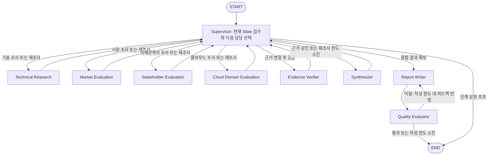

# Subject

**KV Cache 최적화 기술 평가 — LangGraph 기반 Supervisor Multi-Agent 시스템**

본 프로젝트는 소프트웨어 압축 기술인 **TurboQuant**와 하드웨어 메모리 확장 접근인 **CXL-based KV Cache**를 선정하고, 기술 성숙도, 시장성, 이해관계자, 도메인 적용성을 평가한다. 논문과 공개 웹 자료에서 근거를 수집하고, Supervisor가 조사 결과를 검수한 뒤 종합 보고서를 작성하는 구조다.

이 문서는 현재 `supervisor` 브랜치의 구현과 기존 [README.md](README.md)를 기준으로 작성했다. CXL 기반 접근의 대표 분석 자료는 **ITME 논문**이며, 공통 적용 도메인은 **클라우드 기반 LLM 서빙**이다.

## Overview

- **Objective:** 두 기술을 네 관점에서 비교하고 비용·운영 효율 축을 함께 평가하여, 근거와 적용 조건을 연결한 보고서를 생성한다. 특정 기술을 일방적인 승자로 정하는 대신 장점, 제약, 비용 구조, 상충점, 불확실성을 설명한다.
- **Pattern: Supervisor.** 각 조사 결과를 중앙에서 확인하고, 부족한 관점만 재조사시킨 뒤 작성 여부를 판단하기 위해 선택했다.
- **동적 처리:** 기술 조사를 먼저 수행하고, 이후 Supervisor가 현재 State의 미완료 관점, 검증 결과, 재시도 횟수를 보고 다음 담당자를 선택한다. 결과는 매번 Supervisor로 돌아오며 `add_conditional_edges`로 분기한다.
- **현재 범위:** 기술, 시장, 이해관계자, 클라우드의 네 조사 에이전트는 미리 등록되어 있다. 실행 순서와 재조사 대상이 달라지는 방식이며, 새로운 SubTask와 Worker 수를 런타임에 생성하는 Dynamic Fan-out은 구현되어 있지 않다.
- **선택의 대가:** 순차 호출과 중앙 검수에 시간이 들지만, 어떤 관점이 부족하여 재작업했는지 추적하기 쉽다.

| 평가 관점       | 주요 질문                                                                             |
| --------------- | ------------------------------------------------------------------------------------- |
| 기술 성숙도     | 어떤 원리로 동작하며, 구현과 실험은 어디까지 검증되었는가?                            |
| 시장성          | 수요, 공개 채택 사례, 상용화 조건과 도입 장벽은 무엇인가?                             |
| 이해관계자      | 관련 기업, 개발자, 운영자, 투자 업계의 기대와 우려는 무엇인가?                        |
| 도메인 적용성   | 클라우드 LLM 서빙에서 메모리, 지연, 처리량, 품질, 비용에 어떤 조건으로 영향을 주는가? |
| 비용·운영 효율 | 도입·운영·확장 비용과 비용 대비 성능은 어떻게 달라지는가?                           |

## Selected Technologies

| 구분 | 선정 기술                                       | 접근과 선정 이유                                                                                                                                                                                           | 논문 파일                              |
| ---- | ----------------------------------------------- | ---------------------------------------------------------------------------------------------------------------------------------------------------------------------------------------------------------- | -------------------------------------- |
| SW   | **TurboQuant**                            | KV cache의 저비트 압축을 통해 메모리 사용량을 줄이는 접근이다. 메모리·GPU 인스턴스 비용 절감 가능성과 양자화·복원 연산, 품질 검증 비용의 상충을 평가하기 위해 선정했다.                                  | `data/papers/turboquant.pdf`         |
| HW   | **CXL-based KV Cache — 대표 자료: ITME** | CXL-Hybrid 메모리와 저장 계층을 이용해 추론 상태의 수용 용량을 확장하는 접근이다. GPU 메모리 증설 회피 가능성과 CXL·호스트 메모리·SSD 구입, 전력, 데이터 이동, 통합·운영 비용을 비교하기 위해 선정했다. | `data/papers/cxl_based_kv_cache.pdf` |

클라우드 LLM 서빙에서는 두 접근 모두 메모리 병목과 관련된다. 다만 논문별 모델, 장비, 부하, 기준 시스템이 다르므로 성능 수치를 그대로 합치거나 직접 우열을 판단하지 않는다. ITME의 결과를 CXL 생태계 전체의 성능이나 상용화 수준으로 일반화하지 않는다.

## Cost Considerations

비용 평가는 공개 자료와 실행 기록으로 확인할 수 있는 비용 요인을 구분해 분석한다. 현재 프로젝트는 실제 클라우드 청구액이나 기업별 계약 가격을 자동으로 수집하지 않으므로, 아래 항목은 비용 구조와 조건부 추정 중심으로 다룬다.

### 비용 범위

| 비용 구분            | 확인 항목                                                                 |
| -------------------- | ------------------------------------------------------------------------- |
| 모델 호출 비용       | LLM 입력·출력 토큰, Agent 호출 횟수, 보고서 재작성 횟수                  |
| 웹 검색 비용         | Tavily 검색 횟수, 재조사 횟수, 검색 결과 수                               |
| 로컬 처리 비용       | BGE-M3 임베딩 생성 시간, CPU·메모리 사용량, 인덱스 저장 공간             |
| 소프트웨어 도입 비용 | 양자화·복원 연산, 커널 통합, 품질 검증과 장애 대응 부담                  |
| 하드웨어 도입 비용   | CXL 메모리, 호스트 메모리, SSD, 장비·FPGA와 네트워크 구성 비용           |
| 운영 비용            | 전력, 냉각, 모니터링, 유지보수, 인력, 장애와 데이터 이동에 따른 지연 비용 |
| 기회비용             | 비용을 줄이는 대신 품질·지연·처리량·확장성을 잃는 정도                 |

### 기술별 비용 가설

- **TurboQuant:** KV cache의 메모리 사용량이 감소하면 GPU 메모리 증설이나 인스턴스 수를 줄일 가능성이 있다. 반면 양자화·복원 연산, 커널 최적화, 품질 검증과 모델별 재튜닝 비용이 추가될 수 있다.
- **ITME:** GPU 메모리 부족으로 인한 장비 증설을 늦추고 큰 KV cache를 수용할 가능성이 있다. 반면 CXL 메모리·SSD·호스트 구성, 데이터 이동 지연, 전력과 운영 통합 비용이 발생할 수 있다.
- **공통 비교 기준:** 같은 요청량, 문맥 길이, 동시성, 목표 p95·p99 지연, 품질 기준과 기간을 정한 뒤 `총비용 / 처리 요청 수`, `비용 / 유효 처리량`, `비용 절감률`을 비교해야 한다.

### 비용 산정의 한계

현재 코드에는 OpenAI·Tavily의 실제 청구액, 토큰 단가, 장비 가격과 전력 비용을 자동 계산하는 기능이 없다. 따라서 보고서에서 특정 금액이나 ROI를 확정하지 않고, 실행 횟수·재시도·자료량과 공개된 가격 자료를 바탕으로 비용 요인을 설명한다. 실제 비용 비교에는 동일한 모델·Workload·트래픽과 최신 가격표를 이용한 별도 벤치마크가 필요하다.

## Features

- **PDF 자료 기반 정보 추출:** 논문을 페이지 단위로 읽고, 기술 원리, 실험 조건, 성능과 한계를 근거 카드로 정리한다.
- **논문 RAG:** BGE-M3 임베딩과 로컬 FAISS 인덱스로 관련 청크를 검색한다. 기본 청크 크기는 3,500자, 중첩은 500자이며 파일, 페이지, 청크 ID를 보존한다.
- **웹 조사:** Tavily로 시장, 이해관계자, 클라우드 관련 자료를 찾고, 검증 단계에서는 웹 또는 PDF 원문을 수집해 주장을 대조한다.
- **Supervisor 검수와 재조사:** 카드의 관점, 기술, 출처를 검사하고 가능한 경우 구조화된 LLM 검수를 수행한다. 부족한 관점에는 기술명을 포함한 보완 질의를 전달한다.
- **비용 관점 평가:** 모델·웹 검색 호출, 재조사와 재작성 횟수, 로컬 임베딩 처리 비용, 기술 도입·운영 비용을 구분한다. 실제 청구액을 자동 계산하지 않고 비용 구조와 비용 대비 성능을 조건부로 비교한다.
- **비용 폭증 제한:** Supervisor의 전체 단계 상한, Agent별 재시도 상한과 보고서 재작성 상한으로 불필요한 LLM·검색 호출의 증가를 제한한다. 이는 비용 최적화 기능이 아니라 실행 안전장치이며, 실제 예산 차단 기능은 아니다.
- **Worker 실패 대응:** 조사 노드의 예외를 결과의 `failed` 상태로 기록한다. Supervisor는 실행 한도 안에서 재조사를 선택하고, 한도 소진 후에는 자료 한계를 표시한 제한적 종합으로 진행한다.
- **확증 편향 방지:** 두 기술과 네 관점의 근거를 확인하고, 상충 근거와 불확실성을 종합한다. 검증된 사실, 부분 검증 자료를 이용한 해석, 자료 한계를 구분하며 서로 다른 실험 조건의 직접 비교를 제한한다. 반대 근거 탐색용 보완 질의도 제공한다.
- **근거와 인용 추적:** `EvidenceCard`의 주장, 근거 텍스트, 출처 URL, 원문 위치, 검증 상태를 유지한다. 본문에서 사용한 출처만 REFERENCE에 연결하고 동일 출처의 인용 번호를 합친다.
- **보고서 생성:** YAML 목차와 실행 중 수집한 근거를 바탕으로 LLM이 장별 본문을 작성한다. 코드가 근거 ID, 사실 문단의 인용, 수치와 목차를 검사한다. 오류 또는 자료 부족 안내에는 고정 문구를 사용한다.
- **보고서 품질 평가:** 작성 후 규칙 검사와 LLM Judge로 Groundedness, Neutrality, Bias Control, Perspective Coverage를 평가한다.
- **Evaluation Loop:** 품질이 미달이면 피드백을 넣어 보고서를 다시 작성한다. 기본값은 최초 작성과 재작성까지 총 2회이며, 계속 미달이면 `needs_review`로 종료한다.
- **Markdown/PDF 출력:** 동봉한 한글 폰트로 PDF를 생성하고 실제 페이지 수를 검사한다. 10쪽 이내를 목표로 작성하지만, 초과 시 자동 축약하지 않고 검토 필요 상태로 표시한다.

출처 다양성 검사에는 서로 다른 URL이 2개 이상 사용되었는지 확인하는 규칙이 포함된다. 이 조건만으로 출처의 독립성이나 모든 편향 제거가 보장되는 것은 아니며, 내용 검수와 사람의 확인이 함께 필요하다.

## Tech Stack

| 구분                 | 기술                                         | 현재 구현                                                                        |
| -------------------- | -------------------------------------------- | -------------------------------------------------------------------------------- |
| Runtime              | Python 3.11, uv                              | `.python-version`, `pyproject.toml`, `uv.lock` 기반 환경 관리              |
| Framework            | LangGraph                                    | 상위 Supervisor 그래프, 에이전트 내부 그래프, State 공유와 조건부 라우팅         |
| LLM 연동             | LangChain,`langchain-openai`               | 공통`get_llm()`과 구조화된 출력 처리                                           |
| LLM / Generator      | OpenAI, 기본`gpt-4o-mini`                  | 조사, 검수, 종합, 보고서 작성에 사용.`OPENAI_MODEL`로 설정                     |
| LLM / Judge          | OpenAI, 기본`gpt-4o-mini`                  | Generator와 같은 모델 설정을 사용하는 보고서 품질 평가                           |
| Retrieval            | FAISS                                        | 로컬 dense 벡터 검색. 현재 로컬 인덱스는 54개 벡터, 1,024차원                    |
| Retrieval 지표       | Hit Rate@K, MRR                              | **미측정.** 정답 근거가 있는 검색 평가셋과 별도 측정이 필요                |
| Embedding            | BGE-M3 (`BAAI/bge-m3`)                     | 문서와 질의 임베딩, 벡터 정규화.`EMBEDDING_MODEL`로 설정                       |
| Web Search           | Tavily                                       | 공개 웹 자료 검색                                                                |
| Source Fetching      | HTTPX, BeautifulSoup, pypdf                  | 웹 본문, PDF 텍스트, 실제 제공된 서지 정보 추출                                  |
| Schema / Prompt      | TypedDict, Pydantic, PyYAML                  | State와 결과 형식, LLM 출력 검증, YAML 작성 지침                                 |
| Report               | ReportLab, pypdf, NanumGothic                | 한글 PDF 생성과 페이지 수 확인                                                   |
| Observability / Test | LangSmith, logging, pytest, Ruff             | 실행 추적, 결정 JSONL, Mock 테스트와 코드 검사                                   |
| Cost Evaluation      | 실행 로그, 검색·재시도 횟수, 공개 가격 자료 | 비용 요인과 비용 대비 성능을 추정. 실제 API 청구액과 장비 TCO 자동 집계는 미구현 |

인덱스의 벡터 수는 입력 PDF와 청크 설정을 바꾸어 다시 생성하면 달라질 수 있다. 모델 선택 기준은 보고서의 근거 연결, 필수 관점 충족, 처리 시간과 재시도 비용이며, 현재 코드에는 모델별 비용 비교나 검색 지표의 자동 측정 기능이 없다.

## Agents

| 에이전트                | 파일                         | 역할과 입력 자료                                                                                                                    |
| ----------------------- | ---------------------------- | ----------------------------------------------------------------------------------------------------------------------------------- |
| Supervisor              | `agents/supervisor.py`     | State를 검사해 다음 담당자를 선택한다. 관점별 근거 충분성을 검수하고 재조사, 종합, 작성 여부를 결정한다.                            |
| Technical Research      | `agents/technical.py`      | FAISS 논문 검색 후 LLM으로 기술 원리, 구현 조건, 실험 결과와 한계를 추출한다. 다른 관점 평가에 필요한 공통 기술 근거를 제공한다.    |
| Market Evaluation       | `agents/market.py`         | 기술 조사 결과와 Tavily 자료를 이용해 수요, 채택, 상용화 조건과 시장 장벽을 분석한다.                                               |
| Stakeholder Evaluation  | `agents/stakeholder.py`    | 기술 조사 결과와 Tavily 자료를 이용해 경쟁사, 도입 기업, 개발자, 투자 업계의 기대와 우려를 정리한다.                                |
| Cloud Domain Evaluation | `agents/cloud_domain.py`   | 두 기술의 기술 근거, Tavily와 논문 검색 결과로 클라우드 시나리오별 적용성과 운영 제약을 평가한다.                                   |
| Evidence Verifier       | `agents/verifier.py`       | 출처 정보와 원문을 확인하고 주장 일치, 사실과 추론, 출처 품질과 비교 균형을 검사한다. 검증 완료, 부분 검증, 미지원 카드를 구분한다. |
| Synthesizer             | `agents/synthesis.py`      | 검증 상태를 구분해 관점별 일치점, 상충점, 적용 조건과 불확실성을 통합한다. 별도 검색은 수행하지 않는다.                             |
| Report Writer           | `agents/report_writer.py`  | 종합 결과와 허용된 근거 카드로 장별 본문을 생성한다. 사실, 해석, 한계를 구분하고 인용과 수치를 검사해 Markdown을 구성한다.          |
| Quality Evaluator       | `agents/report_quality.py` | 작성된 보고서와 검증 카드를 규칙 및 LLM Judge로 평가하고, 재작성 피드백과 최종 상태를 반환한다.                                     |

각 조사 에이전트의 결과는 `AgentResult`와 `EvidenceCard` 형식으로 전달된다. 상위 그래프에서 워커끼리 직접 연결하지는 않지만, 시장, 이해관계자, 클라우드 평가에는 선행 기술 조사 결과가 필요하다.

## State Schema

현재 `GlobalState`는 `TypedDict`이며, `control`을 별도 묶음으로 두고 입력과 조사 결과는 최상위 필드에 저장한다.

| 구분             | 주요 필드                                                                                                                  |
| ---------------- | -------------------------------------------------------------------------------------------------------------------------- |
| 입력과 계획      | `user_query`, `research_plan`                                                                                          |
| 실행 상관 키     | `trace_id`                                                                                                               |
| 제어 정보        | `control.next_agent`, `status`, `step_count`, `retry_count`, `node_status`, `gap_requests`, `routing_reason` |
| 근거 버전과 승인 | `control.evidence_revision`, `verified_revision`, `evidence_ready`, `evidence_review`                              |
| 관점별 결과      | `technical_result`, `market_result`, `stakeholder_result`, `cloud_domain_result`                                   |
| 근거 카드        | `evidence_cards`, `verified_evidence_cards`, `usable_evidence_cards`                                                 |
| 종합과 출력      | `verification_result`, `synthesis_result`, `final_report`, `quality_result`, `quality_feedback`                  |
| 작성 상한과 오류 | `control.report_revision`, `max_report_revisions`, `max_steps`, `errors`, `last_error`                           |

`usable_evidence_cards`는 검증 완료와 부분 검증 카드를 포함한다. 부분 검증 카드는 사실 문단의 근거로 사용할 수 없으며, 해석 또는 한계에 사용한다.

| 설계 항목                       | 어떻게 구현했는가                                                                                                                                                                                                                                | 왜 그렇게 했는가                                                                                                                                                     |
| ------------------------------- | ------------------------------------------------------------------------------------------------------------------------------------------------------------------------------------------------------------------------------------------------ | -------------------------------------------------------------------------------------------------------------------------------------------------------------------- |
| **제어 vs 페이로드 분리** | 라우팅, 횟수, 상태, 오류는`control`에 두고, 입력, 관점별 결과와 보고서는 별도 필드에 둔다. 별도의 `payload` 래퍼는 사용하지 않는다.                                                                                                          | Supervisor의 실행 판단과 에이전트의 조사 결과를 구분하면서 기존 에이전트 입력 형식을 유지하기 위해서다.                                                              |
| **관측성 위치**           | Supervisor 결정 이벤트를 콘솔과`outputs/logs/*_decisions.jsonl`에 기록한다. State에는 최신 결정, 검수 요약, 최근 오류 최대 8개를 둔다. LangSmith를 활성화하면 노드와 LLM 호출도 추적한다.                                                      | 모든 결정 이력을 State에 반복 누적하지 않고 실행 경로와 판단 이유를 확인하기 위해서다.                                                                               |
| **지속성 비용**           | 재조사 관점의 이전 카드를 새 카드로 교체하고, 동일 근거 ID는 최신 값으로 병합한다. 최종 State는 실행 JSON에 저장한다. 기술 결과의 검색 청크와 검증 결과의 카드 사본도 남으므로 저장량은 증가할 수 있다.                                          | 재조사 이력의 무한 누적을 줄이고 근거 재사용을 가능하게 한다. 검색 본문과 중복 카드의 추가 경량화는 남은 개선 과제다.                                                |
| **비용 상태와 예산**      | 현재 State에 실제 금액, 토큰 총량, 예산 한도 필드는 없다.`step_count`, `retry_count`, 검색·재작성 경로를 비용 요인의 대리 지표로 사용하며, 필요하면 `token_usage`, `tool_calls`, `estimated_cost`, `budget_limit`를 추가할 수 있다. | 구현되지 않은 비용 자동 집계를 현재 기능처럼 과장하지 않고, 비용 통제를 확장할 위치를 명확히 하기 위해서다.                                                          |
| **State / Trace 상관**    | `trace_id`를 State, 결정 JSONL, 최종 JSON과 LangGraph 실행 metadata에 함께 전달한다.                                                                                                                                                           | 로컬 로그와 LangSmith 실행을 같은 작업으로 연결하기 위해서다. 애플리케이션의`trace_id`와 LangSmith 자체 Run ID는 구분한다.                                         |
| **재개 / 복구**           | `--resume-log`로 이 브랜치의 `workflow_result`가 포함된 JSON을 읽는다. 근거, 조사 횟수, 근거 버전, 단계 수를 보존하고 종합, 보고서, 품질 결과를 비워 재실행한다. 보고서 작성 횟수는 0으로 초기화한다.                                        | 이미 수집한 근거를 재사용해 작성과 검수를 다시 수행하기 위해서다. 영속 checkpointer를 연결한 자동 재개 기능은 없으며, 중간에 중단된 노드부터 복구하는 방식은 아니다. |
| **동시 처리**             | 상위 Supervisor는 한 번에 한 노드를 선택한다. 리스트에 병렬 reducer를 두지 않고 카드 ID 기준 병합을 사용한다.                                                                                                                                    | 현재 순차 실행에서는 동일 필드의 동시 쓰기가 발생하지 않기 때문이다. 병렬 Worker로 확장하면 reducer와 제어 필드의 쓰기 정책을 별도로 설계해야 한다.                  |
| **종료 보장**             | 기본`max_steps=24`, 워커별 총 실행 한도 2회, 보고서 총 작성 한도 2회를 사용한다. 단계 상한 초과 시 종료하고, 근거 부족은 제한적 종합, 최종 품질 미달은 `needs_review`로 표시한다.                                                            | 근거 부족이나 반복 실패가 무한 재조사와 재작성으로 이어지지 않도록 하기 위해서다.`step_count`는 전체 노드 수가 아니라 Supervisor 의사결정 횟수다.                  |

## Architecture


```mermaid
flowchart TD
    Start([START]) --> Supervisor[Supervisor: 현재 State 검수와 다음 담당 선택]
    Supervisor -->|기술 조사 또는 재조사| Technical[Technical Research]
    Supervisor -->|시장 조사 또는 재조사| Market[Market Evaluation]
    Supervisor -->|이해관계자 조사 또는 재조사| Stakeholder[Stakeholder Evaluation]
    Supervisor -->|클라우드 조사 또는 재조사| Cloud[Cloud Domain Evaluation]
    Technical --> Supervisor
    Market --> Supervisor
    Stakeholder --> Supervisor
    Cloud --> Supervisor
    Supervisor -->|근거 변경 후 검증| Verifier[Evidence Verifier]
    Verifier --> Supervisor
    Supervisor -->|근거 승인 또는 재조사 한도 소진| Synthesis[Synthesizer]
    Synthesis --> Supervisor
    Supervisor -->|종합 결과 확보| Writer[Report Writer]
    Writer --> Quality[Quality Evaluator]
    Quality -->|미달: 작성 한도 내 피드백 반영| Writer
    Quality -->|통과 또는 작성 한도 소진| Finish([END])
    Supervisor -->|단계 상한 초과| Finish
```

그림의 조사 분기는 동시에 실행하는 Fan-out이 아니다. Supervisor가 매번 한 담당자를 선택하고, 결과를 받은 뒤 다음 경로를 결정한다. 각 조사 노드와 검증, 종합, 작성 노드는 자체 처리 로직이나 내부 LangGraph를 실행한다.

비용 관점은 별도 Worker가 독립적으로 금액을 계산하는 구조가 아니라, 시장·도메인 평가에서 기술별 도입·운영 비용을 조사하고 Supervisor가 호출·재시도 상한을 관리하며 Synthesis가 성능·품질·비용의 상충을 종합하는 방식으로 반영한다.

품질 평가는 SUMMARY와 REFERENCE, 네 관점의 제목, 본문 인용 번호와 참고문헌의 연결, 출처 다양성을 규칙으로 검사하고, LLM Judge가 네 항목의 내용적 품질을 평가한다. Supervisor의 근거 승인도 통과 조건이다. 현재 품질 FAIL 이후의 직접 경로는 **보고서 재작성**이며, 추가 조사나 재종합으로 돌아가는 품질 분기는 구현되어 있지 않다.

최종 본문과 출력은 다음 순서로 구성된다.

`SUMMARY → 분석 배경 → 선정 기술과 선정 이유 → 기술 개요 → 네 관점 평가 → 시사점 → 한계점 → REFERENCE`

그래프가 끝난 뒤 `main.py`가 Markdown을 저장하고 PDF를 생성한다. 품질 통과, PDF 생성 성공, 10쪽 이하를 모두 충족하면 실행 JSON의 상태가 `completed`가 된다. 그 외에는 `needs_review`이며, 작성 실패 안내문은 PDF로 내보내지 않는다.

## Directory Structure

```text
SKALA_langgraph/
├── data/
│   ├── papers/                       # TurboQuant, ITME 원문 PDF
│   ├── vector_db/                    # FAISS 인덱스
│   └── cache/                        # 데이터 캐시 디렉터리
├── src/kv_cache_agent/
│   ├── main.py                       # CLI와 Markdown/PDF 저장
│   ├── config.py                     # 환경변수와 경로
│   ├── llm.py                        # 공통 LLM 연결
│   ├── agents/
│   │   ├── supervisor.py
│   │   ├── technical.py
│   │   ├── market.py
│   │   ├── stakeholder.py
│   │   ├── cloud_domain.py
│   │   ├── verifier.py
│   │   ├── synthesis.py
│   │   ├── report_writer.py
│   │   └── report_quality.py
│   ├── graph/                        # GlobalState, 상위 그래프, 라우팅
│   ├── schemas/                      # AgentResult, EvidenceCard, 품질 결과
│   ├── rag/                          # PDF 분할, 임베딩, FAISS 구성
│   ├── tools/                        # 검색, 원문 수집, 서지 정규화, 인용 검사
│   ├── prompts/                      # 에이전트별 YAML 지침과 보고서 목차
│   └── assets/fonts/                 # NanumGothic Regular/Bold와 OFL
├── tests/                            # 그래프, 에이전트, RAG, 도구 테스트
├── scripts/package_release.py        # 배포 패키지 생성
├── outputs/
│   ├── reports/                      # 생성된 Markdown과 PDF
│   └── logs/                         # 실행 JSON과 결정 JSONL
├── .env.example                      # 키와 모델 설정 예시
├── .python-version                   # Python 3.11
├── pyproject.toml
├── uv.lock
├── DEVELOPMENT_ORDER.md
├── RELEASE_NOTES.md
├── README.md                         # 기존 프로젝트 안내
├── README_TEMPLETE.md                # 문서 작성 템플릿
└── README_V2.md                      # 현재 브랜치 기준 문서
```

## Usage

### 1. 환경 준비

프로젝트 루트에서 Python 3.11과 uv를 사용한다.

```bash
uv sync
```

`.env`가 없다면 `.env.example`을 복사해 생성한다. 이미 있다면 기존 파일을 열어 설정한다.

```dotenv
OPENAI_API_KEY=<본인의 OpenAI API 키>
TAVILY_API_KEY=<본인의 Tavily API 키>
OPENAI_MODEL=gpt-4o-mini
EMBEDDING_MODEL=BAAI/bge-m3
HF_TOKEN=
LANGSMITH_TRACING=true
LANGSMITH_API_KEY=<본인의 LangSmith API 키>
LANGSMITH_PROJECT=kv-cache-supervisor
```

실제 키는 `.env`에만 입력한다. `HF_TOKEN`은 공개 임베딩 모델 다운로드 시 선택 사항이다. LangSmith를 사용하지 않으면 `LANGSMITH_TRACING=false`로 설정할 수 있다. 현재 `config.py`의 `load_dotenv(..., override=True)`는 `.env`에 있는 값을 기존 환경변수보다 우선 적용한다. 설정을 바꾼 뒤에는 프로그램을 다시 실행한다.

### 2. 논문 인덱스 생성

`data/papers/`에 두 논문 PDF를 준비하고 실행한다.

```bash
uv run python -m kv_cache_agent.rag.ingest_papers
```

PDF 로딩, 청크 분할, BGE-M3 임베딩을 거쳐 `data/vector_db/index.faiss`와 `index.pkl`을 생성한다. 자료나 임베딩 모델을 바꾸면 인덱스를 다시 생성한다.

### 3. 전체 워크플로 실행

```bash
uv run python -m kv_cache_agent.main
```

질문과 상세 로그 경로를 지정할 수도 있다.

```bash
uv run python -m kv_cache_agent.main \
  --query "클라우드 LLM 서빙에서 TurboQuant와 CXL-based KV Cache를 네 관점에서 평가해줘." \
  --log-file outputs/logs/demo.json
```

OpenAI와 Tavily의 유효한 키, 논문 인덱스, 네트워크 접근이 필요하다. 기본 실행은 실제 검색과 LLM 호출을 수행한다.

### 4. 산출물 확인

| 위치                                                   | 확인할 내용                                                                                                                       |
| ------------------------------------------------------ | --------------------------------------------------------------------------------------------------------------------------------- |
| `outputs/reports/kv_cache_evaluation_<실행시각>.md`  | 보고서 본문 또는 작성 실패 안내                                                                                                   |
| `outputs/reports/kv_cache_evaluation_<실행시각>.pdf` | PDF 생성에 성공한 경우의 출력                                                                                                     |
| `outputs/logs/workflow_<실행시각>.json`              | `status`, `quality_status`, `pdf_status`, `pdf_page_count`, 오류와 최종 State                                             |
| `outputs/logs/workflow_<실행시각>_decisions.jsonl`   | Supervisor의 선택, 사유, 단계 수, 근거 검수 요약                                                                                  |
| 비용 분석 참고                                         | `step_count`, `retry_count`, Agent별 실행 상태와 검색·재작성 경로를 확인한다. 실제 API 청구액은 별도 결제 콘솔에서 확인한다. |

`--log-file`을 지정하면 JSON은 지정 경로에, 결정 로그는 같은 디렉터리의 `<지정 파일명>_decisions.jsonl`에 저장된다. 파일명의 실행시각은 UTC 기준이다.

완료 판정에는 JSON의 `status=completed`, `quality_status=passed`, `pdf_status=ok`, `pdf_page_count<=10`을 함께 확인한다. `보고서 저장 완료`라는 콘솔 문구만으로 정상 작성 여부를 판단하지 않는다. `401 invalid_api_key` 또는 `OpenAIAuthenticationError`가 있으면 인증 설정을 먼저 확인한다. PDF 오류는 보고서 작성 실패에 따른 후속 결과일 수 있다.

### 5. 저장한 근거로 재실행

```bash
uv run python -m kv_cache_agent.main \
  --resume-log outputs/logs/workflow_YYYYMMDD_HHMMSS.json
```

경로를 실제 이전 실행 JSON 파일명으로 바꾼다. 이 브랜치가 저장한 `workflow_result`를 재사용한다. 새 `trace_id`로 Supervisor 검수, 종합, 작성과 품질 평가를 다시 진행하며, 검증이나 재조사는 보존된 State와 Supervisor 판단에 따른다. 조사 횟수와 전체 단계 수는 초기화하지 않는다. 질문이나 자료가 바뀌었거나 사용할 근거가 없다면 전체 실행을 수행한다.

### 6. LangSmith 추적과 테스트

LangSmith를 활성화한 실행에서는 metadata의 `trace_id`를 로컬 로그와 연결해 다음을 확인한다.

- Supervisor가 선택한 담당자와 재조사 경로
- 각 에이전트의 내부 노드와 LLM 호출
- 검증 후 근거 승인 또는 제한적 종합으로 진행한 경로
- 보고서 작성, 품질 평가와 재작성 경로

Supervisor의 구체적인 결정 사유는 로컬 결정 JSONL과 최종 State의 `control.evidence_review`에도 남는다.

```bash
uv run pytest -q
uv run ruff check src/kv_cache_agent tests
```

테스트에는 Mock을 이용한 관점별 조사, 표적 재조사, 실행 상한, 품질 평가와 재작성, 인용과 출력 스키마 검증이 포함된다. Mock 테스트는 실제 검색 결과의 품질이나 API 인증 성공을 보장하지 않으므로 실제 실행 결과와 구분해 확인한다. 웹 자료는 실행 시점에 따라 달라지며, 비교 재현에는 동일한 PDF, 인덱스 설정, 모델 설정과 출처 기록이 필요하다.

비용을 실제로 비교하려면 동일한 질문 세트와 트래픽 조건에서 모델·검색 호출 수, 입력·출력 토큰, 재시도 횟수, 처리 시간, 로컬 자원 사용량을 기록하고 당시 가격표를 적용해야 한다. 현재는 이 측정과 API 청구액 검증을 수행하지 않았으므로 비용 수치는 **검증 안 함**으로 표시한다.

## Contributors

기존 README의 Contributor 정보와 역할을 보존했다.

| 이름   | 담당 에이전트                              | 수행 역할                                                                             |
| ------ | ------------------------------------------ | ------------------------------------------------------------------------------------- |
| 이재혁 | 슈퍼바이저, 기술 조사                      | 전체 실행 그래프와 작업 조정, 논문 RAG 기반 기술 조사, Agent 호출·재시도 상한 설계   |
| 윤시은 | 시장 평가, 이해관계자 평가                 | 시장 및 채택 현황, 도입 비용과 비용 장벽, 관계자별 반응과 도입 조건 분석              |
| 주연수 | 클라우드 도메인 평가, 근거 검증, 품질 평가 | 클라우드 적용성, 성능·비용·운영 조건, 출처와 주장 검증, 보고서 평가와 재작성 테스트 |
| 이민형 | 평가 종합, 보고서 생성                     | 관점별 결과의 일치와 상충, 비용 대비 성능 해석, YAML 기반 종합 및 보고서 생성         |
