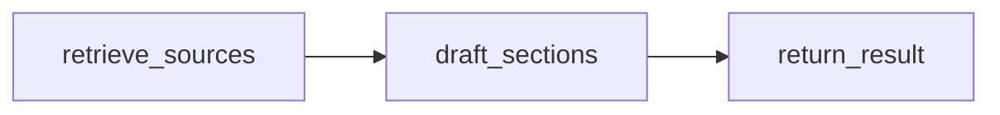

# 6~8단계: 네 조사 작업자의 Task/Result 경로

1~5단계 커밋 `ff227b5` 이후 `jaehyuk-supervisor` 브랜치에서 구현했다.

## 호출 계약

각 에이전트 모듈의 `run_technical_task`, `run_market_task`,
`run_stakeholder_task`, `run_cloud_domain_task`는 `WorkerInput`을 받아
`TaskResult`를 반환한다. `WorkerInput`에는 `ReportPlan`, `ResearchTask`,
선택적 `source_refs`, `existing_evidence`, `existing_drafts`가 있다.
클라우드 작업자는 같은 계획 버전의 `technical_results`도 받을 수 있다.

```python
from kv_cache_agent.agents.technical import run_technical_task
from kv_cache_agent.schemas.worker import WorkerInput
from kv_cache_agent.schemas.research import BudgetLedger

result = run_technical_task(
    WorkerInput(task=task, plan=plan),
    budget=shared_run_budget,
    config=runnable_config,
)
claims = [claim for draft in result.drafts for claim in draft.claims]
verification = verifier.verify(claims, list(result.evidence), config=runnable_config)
```

작업자는 절 소유자·계획 버전·기술·항목 범위를 검사한다. 각 절의 평가 범위와
작업 범위의 교집합만 작성한다. 사실·추론 모두 실제 원문 인용과 별도 SourceRef를
연결하며, 승인 상태를 반환하지 않는다. 모델은 제공된 원문 문단 ID를 선택하고
코드가 실제 문단을 근거로 연결하므로 모델이 인용문을 번역하거나 다시 쓰지 않는다. `status=ok`는 요청 항목의 조사 초안이
반환됐다는 뜻이다. 검증 완료나 보고서 승인 상태가 아니다.

`action=revise`는 배정된 기존 근거와 피드백으로 다시 작성하며 새 검색을 하지
않는다. 네 작업자 모두 누락 항목을 `missing_items`에 `절/기술/항목: 사유`로
반환한다. 원문 실패·예산 소진·LLM 오류는 한계/오류와 실제 호출 횟수를 남긴다.

## 실행과 관찰

각 작업자는 동일한 작은 서브그래프를 사용한다.



모든 노드는 공통 로그 래퍼로 등록한다. `RunSession` 안에서 실행하면 작업 ID,
회차, 절, 기술, 항목, 노드 시작·종료·오류·대기 heartbeat를 기록하고
LangSmith 부모 trace 아래 도구·모델·내부 노드를 연결한다. `config`를 내부
모델과 그래프에 전달해 호출 문맥을 유지한다.

- Technical: 공유 BGE 임베더·FAISS 인덱스로 논문을 검색한다. 원본 PDF 페이지와
  검색 청크의 일치를 확인하고 문서 버전·페이지·청크·가능한 본문 범위를 보존한다.
- Market: 검색 요약으로 분류하지 않고 Search → URL 중복 제거 → Extract 원문
  → YAML 역할 프롬프트와 작업 지시 → 시장 절 초안을 작성한다.
- Stakeholder: 같은 수집 경로를 사용하고 발언 주체·집단·입장과
  `public_statement`/`documented_fact`/`analyst_inference`를 별도 attribution에
  기록한다. 원문에 없는 주체의 공개 발언을 거절한다.
- Cloud Domain: 기술 결과의 실제 SourceRef를 다시 읽고 공통 웹·논문 수집을
  사용한다. 기술 결과의 초안은 검증 전 맥락으로 표시한다. 클라우드 주장에는
  별도 관점과 근거 ID를 사용한다.

## 한도와 원문 연결

웹 검색은 한 작업에서 최대 3번, 결과 원문은 최대 6개 URL을 선택한다.
작업의 `max_search_calls`가 더 작으면 이를 따른다. 통신 시간 초과·429·5xx에만
최대 1회 재시도하며 재시도도 검색 예산을 소비한다. 자료 부족을 이유로 내부
재검색하지 않는다. Extract는 캐시에서 재사용한 URL을 추가 호출로 계산하지
않는다. 전체 실행 예산은 모든 작업자에게 같은 `BudgetLedger`를 전달해야 한다.
각 작업의 사용량은 별도 예약 카운터로 계산하므로 병렬 실행의 다른 호출을
자기 사용량에 더하지 않는다. 최종 생성용 모델 호출 예약을 유지한다.

긴 원문은 캐시에 전문을 남기고 문서 버전에 연결된 본문 범위를 선택한다.
한 범위는 최대 6,000자, 한 문서는 최대 2범위, 전체 모델 원문 문맥은 최대
60,000자다. 선택 범위는 SourceRef.character_range로 표시하며 검증기가 같은
버전의 범위를 다시 읽는다. 검색 요약·묵시적 본문 절단은 사실 근거로 사용하지
않는다. 웹 URL의 종류는 공통 출처 분류기로 판단하며 미확인 도메인을 공식
출처로 올리지 않는다.

임베더는 모델·토큰 설정별로 재사용한다. FAISS는 디렉터리·파일 수정 정보·임베더
객체별로 최대 4개를 재사용하고 저장/변경 시 무효화한다. 새 PDF 수집은 원문
버전을 인덱스 메타데이터에 기록한다. 기존 인덱스에 버전이 없으면 실제 페이지와
청크 일치 검사를 적용한다. 수정된 논문은 인덱스를 다시 생성해야 한다.

공통 검증 정책은 `source-grounding-v2`로 갱신했다. 실제 문장이 배정된 항목과
관점에 답하는지도 별도 판정한다. 기술 원리가 원문에 있다고 해도 클라우드 지연이나
시장 채택의 Coverage를 채우지 않는다. 항목 적합성이 불명확하면 승인하지 않으며
다른 항목에 관한 주장은 재조사 대상으로 반환한다.

기존 Cloud Domain 어댑터의 URL만으로 페이지를 선택하던 처리를 수정했다.
명시된 locator와 일치하는 자료가 없으면 다른 페이지로 대체하지 않고 누락으로
반환한다.

## 현재 전환 범위

새 Task/Result 호출 경로는 6~8단계에서 완성했다. 기존 CLI·고정 워크플로는
호환 경로를 유지한다. 따라서 기존 명령을 실행하면 아직 이전 에이전트 흐름을
사용한다. Supervisor의 계획·동적 판단은 9단계, 폐루프·병렬 배정 연결은 10단계,
최종 보고서·CLI 기본 경로 전환은 11~12단계에 진행한다. 이전 내부 그래프·프롬프트
제거는 13단계다.

검증은 `tests/test_task_workers.py`, `tests/test_rag_reuse.py` 및 기존 회귀
테스트에서 수행한다. 11단계 보고서 수치 검증과 12단계 CLI 실패 상태 사례는
예정된 strict xfail로 유지한다.

참조: [LangGraph 서브그래프 공식 문서](https://docs.langchain.com/oss/python/langgraph/use-subgraphs),
[Tavily Extract 공식 문서](https://docs.tavily.com/documentation/api-reference/endpoint/extract).
