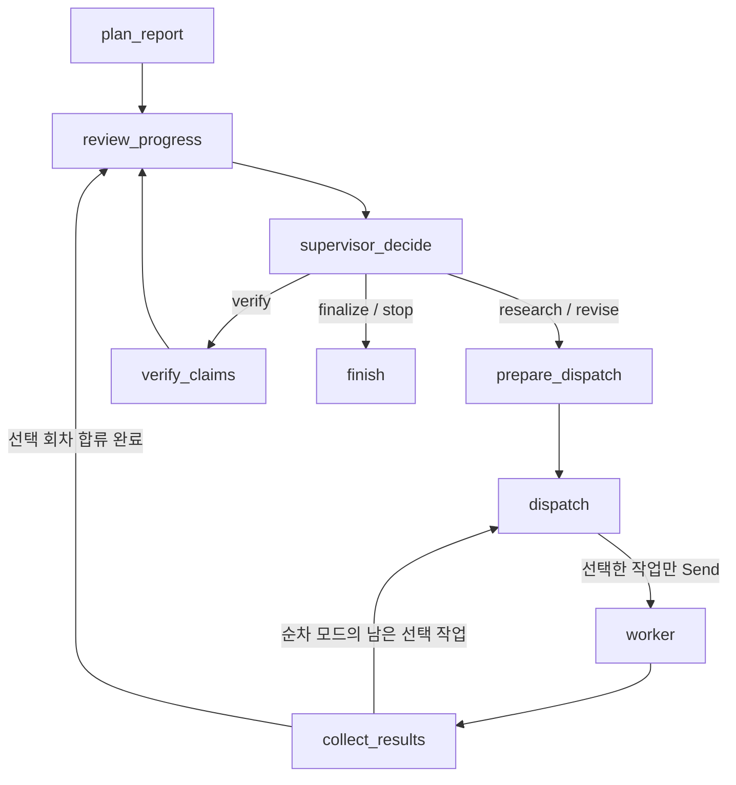

# 9~10단계: 계획을 먼저 만드는 동적 Supervisor 폐루프

기준 브랜치 `jaehyuk-supervisor`, 기준 커밋 `76430eb`에서 구현했다.

## 공개 진입점

`graph/workflow.py`의 `build_supervised_workflow()`는 호출마다 별도 상태·예산·메모리
체크포인터를 생성하는 서비스를 반환한다. 기존 `build_workflow()`와 CLI 기본
경로는 보고서 이관이 끝나는 11~12단계까지 유지한다.

```python
from kv_cache_agent.graph.workflow import build_supervised_workflow
from kv_cache_agent.observability.logger import RunSession
from kv_cache_agent.config import OUTPUTS_DIR

with RunSession(OUTPUTS_DIR / "logs") as run:
    state = build_supervised_workflow().invoke({"user_query": user_query})
    run.finish(
        "failed" if state["status"] == "failed" else "provisional",
        research_status=state["status"],
        termination_reason=state["termination_reason"],
        budget_usage=state["budget_usage"],
    )
```

`report_plan`을 입력하면 동일 사용자 질문의 계획을 검증해 사용한다. `source_refs`는
Technical에 초기 원문을 지정하는 선택 입력이다. 저장된 계획을 사용해도 새 호출의
작업 ID·예산·체크포인터는 독립적이다. 외부 결과/검증 상태를 임의로 주입하는
입력은 허용하지 않는다.

## Supervisor의 두 기능

- 계획: `supervisor_plan.yaml`을 사용해 사용자 질문의 실제 목차, 담당 절,
  기술·평가 항목·원래 질문·의존성·직접 사실이 필요한 기준을 작성한다.
- 판단: `supervisor_route.yaml`로 현재 초안·출처·검증 판정·누락·예산을 읽고
  필요한 항목의 동적 objective, questions, feedback를 작성해 배정한다.

소유자와 관점, 두 기술/네 작업자의 실제 평가 절, 완료 기준, 질문, 순환 의존성을
코드로 검사한다. 시장·이해관계자는 최소 한 항목의 직접 사실 근거를 요구한다.
시장 규모·상용화·실제 채택·공개 발언 항목은 추론만으로 충족시키지 않는다.
비기술 작업은 해당 기술의 선행 기술 항목이 검증된 뒤 실행할 수 있다.

현재 초안의 새 문장은 라우팅보다 먼저 검증한다. 작업자가 `ok`라고 반환하거나
이전 카드가 검증됐다는 이유로 현재 문장을 채택하지 않는다. 주장·근거·출처 버전과
검증 정책이 바뀌면 이전 판정을 무효화한다. 현재 전체 필수 셀의 Coverage는
검증된 사실과 충분히 지지된 명시적 추론으로 다시 계산한다.

모든 셀이 채워지면 마지막으로 Supervisor 모델이 목차의 실제 질문에 답하는지
의미적 충분성을 검토한다. 프로토타입을 설명하는 검증된 사실이 있어도 계획이
요구한 실제 운영자 채택 질문에 답하지 못하면 보완할 수 있다. 이 경우 제공된
질문 ID, 부족 이유, 해당 절·기술·항목을 명시해야 한다. 질문 ID는 코드가 원래
질문으로 변환하므로 모델이 인용문을 다시 쓰거나 새 질문을 추가하지 않는다.
이미 충족된 항목을 사유 없이 반복 실행하거나 계획 밖 항목을 추가할 수 없다.

## 실행 그래프



작업자는 task_id별 `WorkerDelivery`만 갱신한다. 계획·제어·절 초안·Coverage는
부모의 조정 노드가 갱신한다. 병렬 합류는 선택한 작업 수를 기준으로 하며
호출하지 않은 작업자를 기다리지 않는다. `parallel=False`에서는 같은 회차의
선택 작업을 하나씩 실행한 뒤 같은 판단 경계로 합류한다.

한 절의 일부 셀을 보완하면 그 셀만 교체하고 나머지 승인 문장은 유지한다.
따라서 CXL 시장만 다시 조사해도 TurboQuant 시장 문장과 그 검증 판정은 보존된다.
같은 절의 서로 다른 셀을 선택 병렬 실행해도 부모가 같은 절 버전에 합친다.

실행 실패는 실패 결과로 회수해 다른 선택 작업의 결과를 보존한다. 이전 회차의
지연 결과는 버리고 현재 작업의 실패/누락으로 기록한다. 잘못된 작업 ID·담당·절·
주장·근거 연결·검증 정책/출처를 반환하면 계약 오류로 실패 종료한다.

## 예산과 종료

한 회차의 호출 한도를 배정 전에 원자적으로 확보한다. 작업별 할당을 다른 작업이
사용할 수 없으며, 실제 시도만 사용량에 더한다. 완료하면 사용하지 않은 확보분을
반환하고 실패한 시도는 반환하지 않는다. 전체 예산이 부족하면 실행 가능한 작업만
선택하고 나머지는 합류 대기 대상에서 제외한다. 중간 검증 한 번의 모델 호출과
최종 마무리용 `finish_reserve`를 보존한다.

Search, Extract 요청, 실제 Extract URL, 모델 호출을 별도로 제한한다. 캐시 원문은
새 URL 호출로 세지 않는다. 기존 참조 원문을 먼저 예산 내에서 일괄 수집하고,
남은 URL 한도에 맞춰 신규 원문을 선택한다. Technical의 로컬 논문 질의는 웹
검색 호출로 계산하지 않는다. OpenAI 모델의 숨은 SDK 재시도는 0으로 설정했다.

공통 검증은 주장 수와 실제 고유 원문 길이를 함께 보고 배치를 나눈다. 여러
작업자 원문을 합쳐 80,000자를 넘는 배치를 모델에 전달하지 않는다. 단일 주장에
지나치게 큰 원문이 연결되면 기존 명시적 범위 축소 오류를 유지한다.

최초 배정 포함 기본 최대 3회 회차, 연속 무진전 2회, 연구/수정/검증 예산과
LangGraph recursion_limit을 적용한다. 단순 버전·시각 변화는 진전으로 보지 않고
현재 승인 문장·지지된 새 원문·완료 셀의 증가를 본다. 마지막 충분성 검토를 못 한
경우 완료로 가정하지 않는다. 추적이 활성화됐는데 키·프로젝트가 없으면 조사 전에
실패한다. 계획·라우팅·검증 계약 오류도 실패로 기록한다.

현재 반환 상태는 다음과 같다.

| 상태 | 의미 |
|---|---|
| ready_for_finalization | 필수 셀 검증 및 Supervisor의 질문 충분성 판단을 통과해 11단계 마무리에 넘길 수 있음 |
| provisional | 회차·예산·무진전·자료 부족으로 종료; 검증된 문장과 누락/미답변 질문을 보존 |
| failed | 필수 설정·계획/작업/검증 계약·실행 또는 마무리 훅이 실패 |

`finalization_input`에는 검증된 문장만 남긴 초안, 계획, Coverage, 누락 항목,
미답변 질문과 종료 사유가 있다. 이것은 완성 보고서가 아니다. `finalizer`는 10단계
검증을 위한 주입 훅이며, 기본 실행은 보고서 파일을 생성하지 않는다. 훅에 전달된
공통 예산에서 `finishing=True`로 예약분을 사용할 수 있다. 실제 최종 주장 생성·
검증·수정·Markdown/PDF 렌더링과 완료/잠정 문서 정책은 11단계에 이관한다.

## 로그와 검증

모든 부모 노드와 내부 작업자·검증 노드는 공통 래퍼를 사용한다. Supervisor
행동·라우팅 사유, 선택/보류 작업, 확보/사용 예산, 회차 합류, 진전, 이전 결과 폐기,
종료 이유를 JSONL과 콘솔에 기록한다. 실패 Delivery도 node_end에서 실패로 표시한다.
체크포인터에는 프로젝트 계약 타입만 명시적으로 등록하고 strict msgpack 역직렬화를
통과시켰다. 재귀 제한 예외에서도 마지막 부모 상태를 보존한다.

검사는 `test_supervisor_control.py`, `test_supervised_workflow.py`,
`test_dispatch_budget.py`와 기존 작업자/검증 모듈의 통합 검사에서 수행한다.
핵심 사례는 CXL 시장만 재배정, 기술 선행 조건, 완료 대상 불필요 재실행 거절,
프로토타입과 실제 채택의 질문 충분성 차이, 순차/병렬 합류, 일부 절 보존,
지연·실패 결과, 예산 원자성/반환/마무리 예약, 무진전·회차·재귀 종료다.

참조: [LangGraph Send와 그래프 API](https://docs.langchain.com/oss/python/langgraph/graph-api),
[루프와 재귀 제한](https://docs.langchain.com/oss/python/langgraph/use-graph-api).
