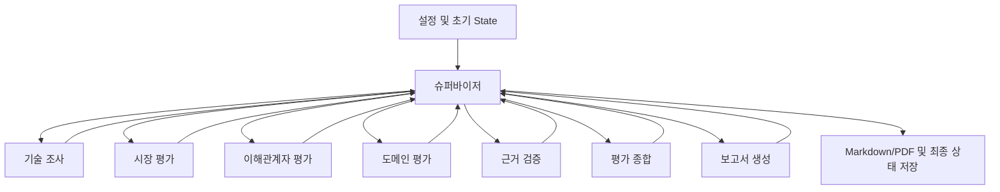

# 실행·분기·종료 조건

`src/graph.py`는 연결과 병렬 실행을, `src/agents/supervisor.py`는 배정/검토/재조사 결정을 담당합니다.
모든 서브에이전트는 다른 에이전트를 직접 호출하지 않고 결과만 반환합니다.
기술 조사 결과를 검토한 뒤 시장·이해관계자·도메인 노드를 같은 super-step에서 실행합니다.
각 노드의 결과가 합쳐진 다음 슈퍼바이저가 검증을 배정합니다.
[LangGraph Graph API](https://docs.langchain.com/oss/python/langgraph/graph-api)의 상태 및 조건부 연결을 사용합니다.

## 재조사

1. 에이전트 내부: 질문 생성 → 도구 검색 → 원문 확보 → 근거 분석. 근거 부족 시 검색을 보완합니다.
2. 검증 후: 출처/주장/조건 문제에 따라 해당 담당자만 다시 배정합니다.
3. 기술 조사 변경: 그에 의존한 시장/이해관계자/도메인 및 후속 결과를 무효화하고 한도 안에서 다시 평가합니다.
4. 종합 보완: 보완 요청을 슈퍼바이저가 검토하고, 조사 또는 종합 재시도를 배정합니다.
5. 보고서: 목차/인용/편향/네 관점/실제 PDF SUMMARY 높이를 검토하고 보완 요청을 반환합니다.

각 반복은 최초 실행 이후 추가 재시도 최대 2회가 기본입니다. 설정값 0이면 최초 실행만 허용합니다.
전체 호출/시간 한도에 도달하면 새로운 호출을 시작하지 않고 검토 필요 상태로 종료합니다.
진행 중 요청은 요청별 timeout을 따르며, 임의 중단·체크포인트 재개는 구현하지 않습니다.
검토 미통과를 completed로 바꾸지 않습니다. 초안은 draft-report 이름으로 저장합니다.

## 로그와 저장

공통 실행 래퍼가 시작/반환/예외/소요 시간을 기록하고 장시간 작업의 마지막 상태를 주기적으로 알립니다.
병렬 완료 수는 배정 회차마다 초기화합니다. 중복 결과를 새 완료 건으로 세지 않습니다.
원문 검색 건수와 검증 주장 건수는 별도로 집계합니다.
`events.jsonl`은 스레드 잠금으로 순서대로 기록합니다. API 키는 로그와 결과에서 마스킹합니다.
`tasks/{task_id}/attempt-{attempt}.json`은 덮어쓰기를 거부합니다.
PDF는 한글 폰트를 포함하고 SUMMARY의 실제 높이를 A4 사용 가능 높이의 절반과 비교합니다.
한도 초과/폰트 실패/내보내기 실패는 최종 검토 필요 상태에 반영합니다.
